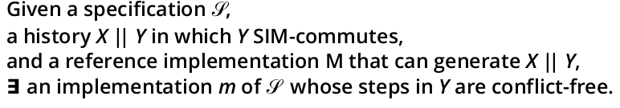
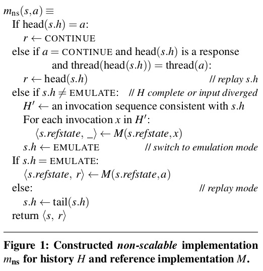
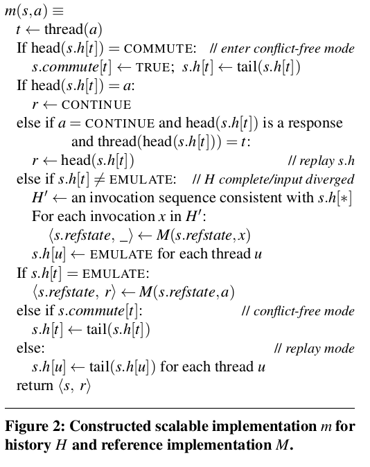

# Proof for [the scalable commutativity rule](http://courses.cs.washington.edu/courses/cse551/15sp/papers/commutativity-sosp13.pdf)
## Rule

## Construction

### non-scalable construction

### scalable construction

## Understanding

### 证明思路
证明目标是给定specification，参考实现M，以及M产生的history H = X||Y, 其中Y SIM-commutes in H条件下，存在一种符合specification的实现使得Y部分的步骤是scalable的。（只是证明存在性，可能不impractical）

通过构造证明的方法，分以下两步：
1. 证明存在一种符合specification的non-scalable的实现
2. 改进使得上述实现scalable

### terms
s.h: 还需要replay的history: remaining H. eg, s.h="BBA" of history "ABBA" 或者 EMULATE
s.refstate: 参考实现的state信息

s.h[t]: 线程t的s.h
s.commute[t]: 线程t是否到达可交换区
s.refstat: 参考实现M的state信息

### dive into the non-scalable

1. replay: 当输入invocation match H的时候，即history下一个元素是同一个线程outstanding invocation的response的时候直接返回response
2. emulate： 当输入和H不match的时候，需要让参考实现M模拟来返回结果，其中参考实现M需要读入当前s.h前缀的invocation历史来做出响应。每当.sh置为EMULATE后，后续m(s, a)都将采用emulate，返回参考实现的结果。

以上过程产生的response和参考实现M的response的结果都一致，这说明构造的实现符合specification，是正确的。但是上述实现是non-scalable的，因为在replay的时候，在可交换区域的部分的任何两个步骤都需要冲突的访问并修改s.h。然而在这个可交换区域Y中，并不要求严格的顺序，只要是Y前缀的reordering，都会产生出不可区分的response。

### dive into the scalable

对以上non-scalable实现进行修改使其scalable。

s.h[t]: 每个线程的history，初始为X||COMMUTE||(Y|t)

从上图构造方法中可以发现，对于交换区Y之前的实现与non-scalable相同。在交换区内，每个线程因为都有一份自己的history，不会产生conflict，也就是conflict free。此外，在初始化参考实现的状态时，在交换区内或者之后（如果之前，做法与non-scalble实现相同），由于我们没有全局history，只有每个线程的history，我们需要对各个线程的history进行reorder。但是在交换区内我们有SIM commutativity性质，这样任何reorder都会产生不可区分的结果。

综上，在给定specification，参考实现M，以及M产生的history H = X||Y, 其中Y SIM-commutes in H条件下，存在一种符合specification的实现使得Y部分的步骤是scalable的。（只是证明存在性，可能不impractical）
