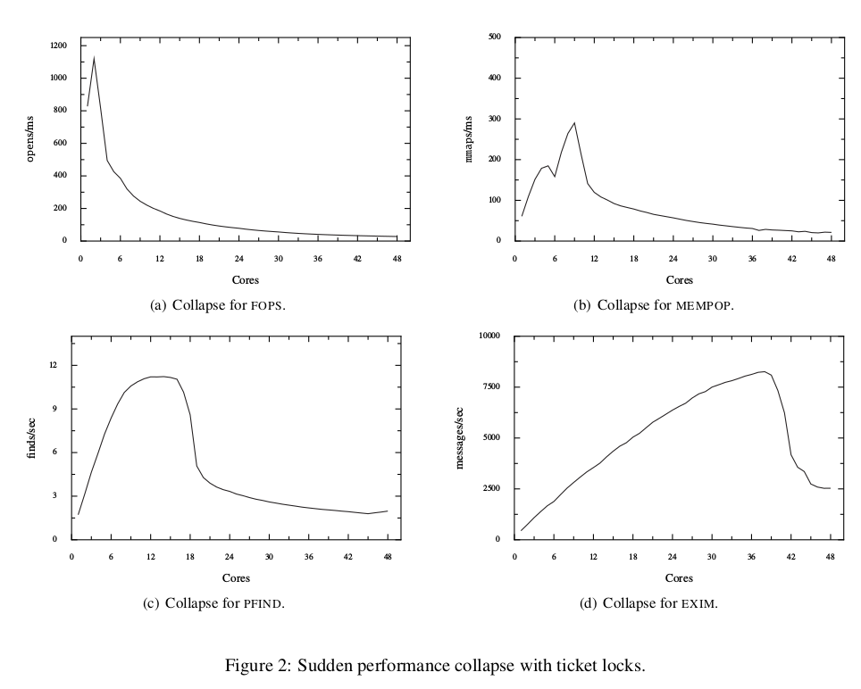
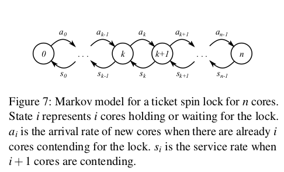
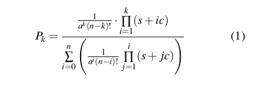
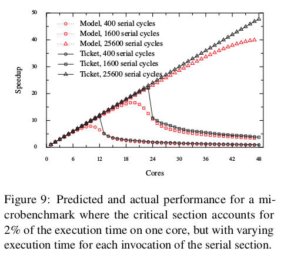
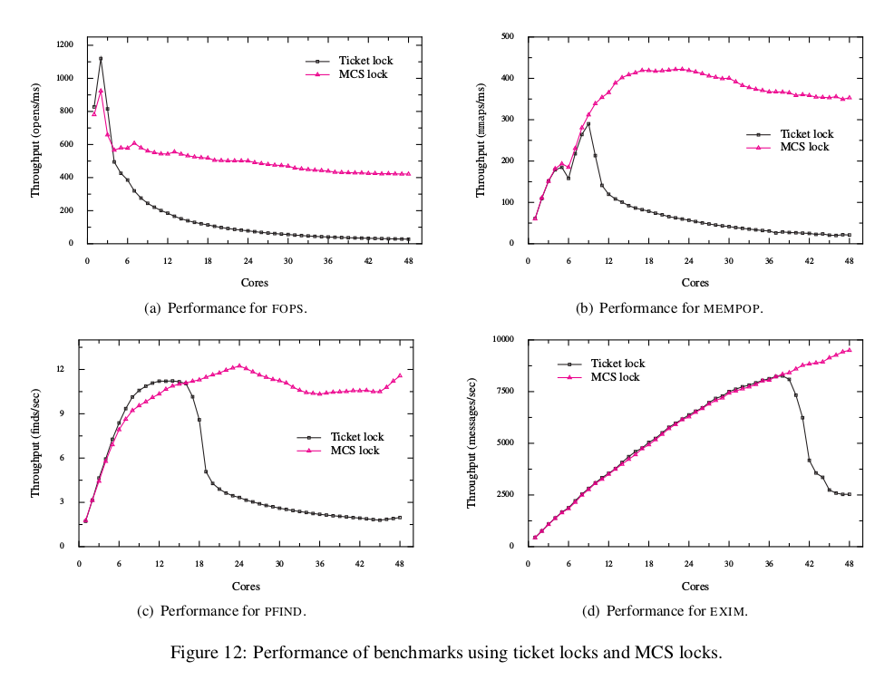

# Report for the paper: Non-scalable locks are danagerous

## Summary of major innovations
当下，很多操作系统比如Linux使用Ticket spinlock这种不scalable的锁机制做同步。在多核环境下，本文实验发现使用non-scalable的锁会非常危险，很有可能随着core的变多，出现性能collapse的现象。本文主要有三点贡献：
1. non-scalable locks可能会导致核心的增多，性能锐减甚至不如单核心的现象。
2. 使用了马尔科夫模型对锁机制进行建模，综合考虑contend和uncontended情况，从所内部机制实现上解释了collapse的原因。
3. 将Linux中的ticket spinlock替换为scalable的锁机制，发现MCS锁可以得到最好的scalability，不同scalable locks之间相对scalability差异较小。

## Problems this paper mentioned
本文通过四个实验测试发现Linux使用的non-scalable ticket spinlock随着core的增加出现throughtput collapse的现象。而不是按照Amdahl's Law scale到 1/p个核心，p是临界区占总运算量的占比。如下图所示：

## Some intriguing aspects of this paper
个人认为本文比较intriguing的地方在于很多核心在锁机制同步的时候的状态进行建模，使用了马尔科夫模型，做到比较综合地考量各种因素包括临界区长度等。以下简单介绍一下这部分的工作：

### Markov Model

上图中，共有n+1个状态，每两个状态之间可相互转移，对n个core进行建模。A代表Arrival，表示有core申请得到锁；S代表Service，将锁分配给一个core。

`Arrival`

A(k)代表状态k（已经有k个waiter or holder）下增加了一个新的core作为锁的waiter的概率 or rate。
设a为一个core连续两次申请锁的平均时间。那么一个核心申请锁的概率为1/a. 在k个核心已经在wait or hold锁的情况下，A(k) = (n - k) / a;

`Service`

定义：
1. s代表临界区的时间开销。
2. c代表directory-based cache机制中home directory对一个cache line请求做出响应的时间。因为lock变量多个核心共享，当一个核心修改变量后，该核心自身的cache被修改，其他核心该锁的cache要invalidate，重新从内存中load到cache中。
3. S(k)代表在k+1个waiter or waiter情况下的将锁交给一个核心的service rate。

在随机情况下，有k个waiter时，ticket spinlock把锁控制权交给一个waiter的时间是 c * k / 2.
那么：
S(k) = 1 / (s + c * k/2)

**Steady State**

P(k) * A(k) = P(k+1) * S(k)

so, 

P(k+1) = P(k) * A(k) / S(k) = P(0) * ...  

and sum(P(k)) = 1

so P(k) = ... as following:

Then the average number of waiting(idle) cores:

w = sum(i * P(i)), i: [0, n].

Then, Speedup is **n - w**

至此，本文基于马尔科夫模型综合考虑了Arrival, Service进行建模，从锁内部机制上对多核的加速比进行预测。
Note:
上述公式中有a, s, c, n四个变量，a, c, n均为常数，s代表临界区长度，与任务有关。

### Validate model

上图显示，对于临界区较大情况下，没有出现collapse。原因是S(k)中s较大，c的影响较小。

## Experiments: test/compare/analyze

将Linux默认的non-scalable spinlock换成scalable锁之后变现如下：

## Future work

scalable的锁能解决collapse的问题，使得增加核心，性能依然会增加。但是lock-free情况下结果会更好。

## Related Work
1. 论文[1]发现spin locks对性能可能造成坏的影响。论文讲述了基于test-and-set, test-test-and-set-set的spin lock对整体性能造成下降。论文还提出了一种队列实现并且对backoff进行tune的锁的实现方法。(个人认为是ticket spinlock with backoff)
2. 论文[2]发现test-and-set lock随着核心变多，acquisition也线性增多。论文提出了MCS lock，保证锁获得先到先服务；只在本地spin，这样在锁release的时候只会invalidate一次cache，复杂度O(1)。具备较好的scalibility；时间复杂度O(k),空间复杂度为2 * P + N for p processors and N locks.
3. 文章[3]说明了ticket lock在EXIM benchmark下带了性能collapse，但是没有解释。
4. 论文[4]提供了并行程序加速比的公式，考虑了临界区。此外，论文还指出有情况可以使得加速比大于Amadahl's Law. 但是这个工作区别对待contended and uncontended。本文则从锁内部原理，综合考虑了锁contend and uncontended情况建立了马尔科夫模型，预测并解释了随着核心增多，性能会出现collapse现象。

## Survey paper list
1. T. E. Anderson. The performance of spin lock alter-natives for shared-memory multiprocessors. IEEE Trans. Parallel Distrib. Syst., 1:6–16, January 1990.
2. John M.Mellor-Crummey, Michael L.Scott. Algorithms for Scalable Synchronization on Shared-Memory Mulitprocessors. TOCS. January 1991.
3. S. Boyd-Wickizer, A. Clements, Y. Mao, A. Pesterev,M. F. Kaashoek, R. Morris, and N. Zeldovich. Ananalysis of Linux scalability to many cores. OSDI 2010, Vancou-ver, Canada, October 2010
4. S. Eyerman and L. Eeckhout. Modeling critical sec-tions in Amdahl’s law and its implications for multicore design. In Proceedings of the 37th AnnualInternational Symposium on Computer Architecture(ISCA), pages 262–370, Saint-Malo, France, June2010.

