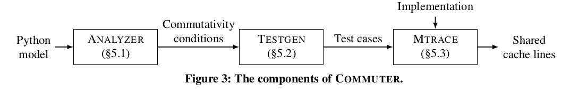
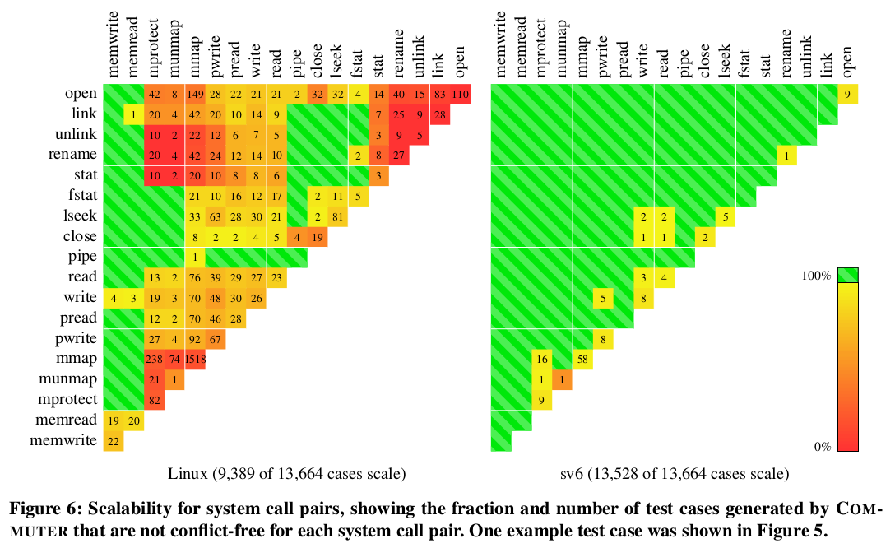
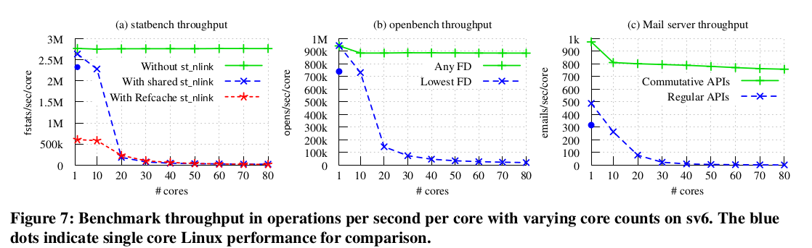

# Report for Scable Commutativity Rule: Designing Scabable Software for Multicore Porcessors, Best Paper in SOSP2013
## Summary of major innovations
* 本文重点贡献在于提出了基于交换性的可扩展规则：只要接口可以交换，一定存在一种可扩展的实现。该规则在接口定义阶段就可以应用而不是在实现阶段。这个规则可以帮助开发者从接口设计阶段、实现、测试以及评估阶段开发从而得到扩展性更强的软件。
* 本文还开发出了工具**COMMUTER**，它接受高层的接口模型作为输入，计算接口可交换的条件，并产生可交换的接口的测试。这样，COMMUTER可以用来评估实现的可扩展性的强弱。在试验中，使用COMMUTER开发出的系统具备更高的可扩展性。
## Related work
1. Thinking about scalability: Israeli和Rappoport引入了disjoint-access-parallel内存系统。如果共享内存系统是disjoint-access-parallel，那么访问disjoint内存的进程可以线性地扩展。
2. Designing scalable OS. (1)迭代：设计、实现、评估 (2)在多核中，使用多个kernel来避免共享数据从而达到扩展性
3. Commutativity. (1)Steele描述了一个并行编程原则：所有的操作要么是因果关联，要么是可以交换。这里可交换指没有冲突。本文的可交换指可扩展。(2)Rinard和Diniz描述了怎么使用可交换性来自动产生并行运行的代码。
4. Test case generation. 之前的concolic testing以及symbolic执行通过symbolically执行一个具体的实现来产生测试。本文的COMMUTER结合symbolic和concolic，但是产生了基于接口定义的任何实现的测试样例。此外，本文COMMUTER想要达到尽量大的冲突覆盖范围，这样测试到不同访问模式。

---

## Some intriguing aspects of this paper
### The Scalable Commutativity Rule
1. Actions
    * action: avocation或者response
    * history: 系统的执行历史。一个well-formed history每个线程每一个时刻最多只有一个outstanding invocation
2. Commutatility
    + H' is reordering of H, iff 对每个线程t，有H|t = H'|t。就是说线程内顺序不变，线程间顺序可以变化
    + Y SI-commutes in H: H = X||Y, iff any Y' of Y, X||Y||Z <=> X||Y'||Z (history符合specification)。描述了接口以及状态依赖。但是commute性质不monotonic，即Y SI-commutes，Y的前缀可能不SI-commutes
    + Y **SIM-commutes** in H: any Prefix P of Y, P SI-commutes in X||P, Where S means state-dependent, I means interface-based and M means monotonic.
#### to be continued
3. Implementation
4. Rule
5. Proof

### COMMUTER

1. ANALYZER: 自动化软件接口的交换性的分析处理
    + 输入： 接口行为的模型Python model
    + 输出： 接口可交换的conditions： 有参数的表达式以及状态
    + 方法： to be continued
2. TESTGEN: 把ANALYZER产生的可交换性的条件转化为具体的测试样例
    + 大致过程：在model中为每一个变量赋值，然后TESGGEN通过调用一个模型相关的函数来产生C测试样例
    + 目标：尽量覆盖潜在的扩展性问题
        + path coverage
        + conflict coverage
3. MTRACE and Implementation
根据COMMUTER得到的可交换的条件以及产生的测试样例，本文实现了18个posix接口的ramfs。MTRACE基于实现的ramfs运行测试样例，得到不支持扩展的实现位置，存在内存访问冲突并报告被冲突访问的C语言的数据类型。

---

## Experiments: test/compare/analyze
### Finding scability opportunities
#### Setup
1. 包含18个系统调用接口的模型（COMMUTER），包括inodes, file names, fd, link, mmap等。
2. 13664个测试样例
3. linux, sv6

#### scability on linux VS sv6

1. linux 4275/13664 不扩展。原因主要有：
    + 共享的引用计数
    + 虚存中粗粒度的锁
2. sv6 136/13664 不扩展。做的改进有：
    + Layer Scability
    + Defer work
    + Precede pessimism with optimism
    + Don't read unless necessary

### Performance evaluation

#### Setup
+ sv6, POSIX APIs
+ 80 cores(8 Intel E7-8870 chips, each 10 cores), 256G RAM
+ prefetcher disabled(false sharing)

#### statbench/openbench
1. statbench: 一半核心重复调用fstat，另一半重复link或者unlink这个文件。 因为fstat需要返回这个文件的link count，这样可以测试到使用native fstat以及使用modefied fstatx对scability的影响。
    + scability 如上图所示，statbench中fstatx具有很好的可扩展性，基本在L2 cache中零miss。
    + performance fstatx牺牲掉部分sequential性能
2. openbench: n个线程同时打开关闭文件，这涉及到fd的分配与回收。在linux中，fd的分配是使用最小未使用的file descriptor，这就影响了打开文件、关闭文件的扩展性。本文使用了O_ANYFD标志打开文件，这样分配fd时候选择本核心内未使用的一个fd。
    + scability O_ANYFD具备更高的可扩展性
    + performance O_ANYFD没有带来明显的性能损失

#### application performance: Mail server
类似于openbench，比较了不可交换的实现与可交换的实现（O_ANYFD和posix_spawn）对扩展性的影响。对于Mail server来说，尽管涉及操作很多，我们得到很相似的结果。不可交换的操作降低了扩展性，可交换的操作得到了很好的扩展性。

## How can the research be improved?
1. Commutativity is not necessary for confict-free implementations. It is a sufficient but not necessary contition.
2. Confict-free access patterns may not scale on real machines when memory bus is full used.

## Survey paper list

## More about this paper
[Home of COMMUTER pdos.csail.mit.edu](https://pdos.csail.mit.edu/archive/commuter/)

