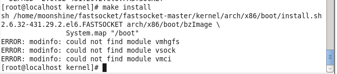
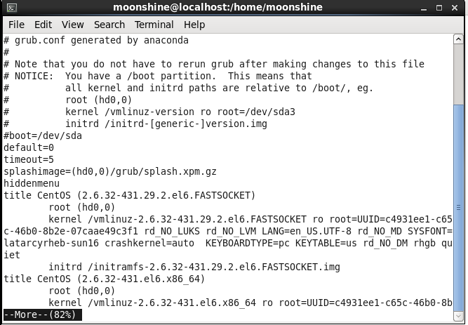
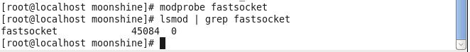
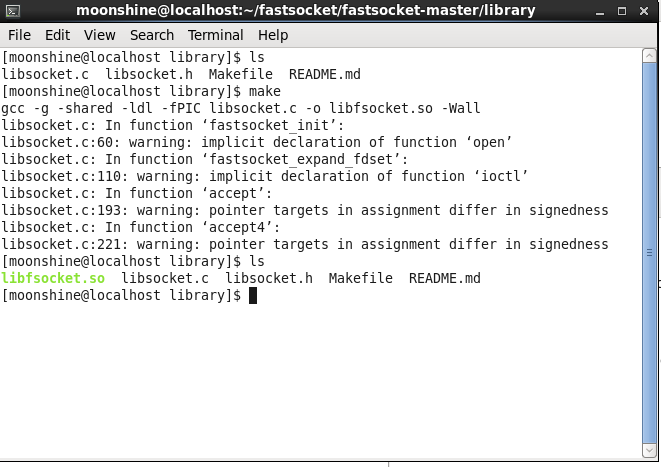

## 安装

因为涉及到内核,编译之前需要做一些参数选项配置,使用$make  \ \ config$需要配置好几千个选项,所以采取默认配置:

```shell
make defconfig	
```

然后编译内核:

```shell
make	
```

之后,编译所需的内核模块,fastsocket模块：

```shell
make modules_install	
```

最后安装内核

```shell
make install
```

### question:

安装过程中遇到



### 原因分析：

​	在make install时，为了让新内核中不缺少所需module，会先检查当前系统已经加载了的module（lsmod命令可查看），然后对比新安装的内核模块，如果新的内核模块中缺少一些module（和当前lsmod命令的输出做对比），就会报“ERROR: modinfo: could not find module power_meter”这样的错误信息。

### 解决方案:

* 确实是缺少了某个module:解决方案：如果这个module有用,检查编译kernel时得.config文件,加上对应的配置(配为=m),重新编译和安装modules即可,如果没有用,大可不必管它。(**缺少的模块都是vmtools的模块，用不到**) 
* 新编译的kernel已经将选项编译进kernel(.config中选择为Y),从而不需要生成这个module的.ko文件,系统找不到对应的.ko文件，但是已经在新内核中,不必理会这个报错。
* 模块的名称变了,用当前系统lsmod命令查找的模块名称,在新编译的内核中找不到module了。只需要检查确认即可。


### 最后配置启动时,需要切换的内核

在$/etc/grub.conf$中配置:



修改default=0,默认启动FASTSOCKET内核。


#### 检测生效

系统重启后,加载fastsocket模块到系统运行中去,以默认选项参数方式加载：

```shell
modprobe fastsocket
```

加载之后,列出当前系统所加载模块列表,检查是否成功：

```shell
lsmod | grep fastsocket
```

输出:



#### 构建libfastsocket.so链接库



最后,可以看到gcc编译之后生成的**libfsocket.so**库文件,说明编译成功。

