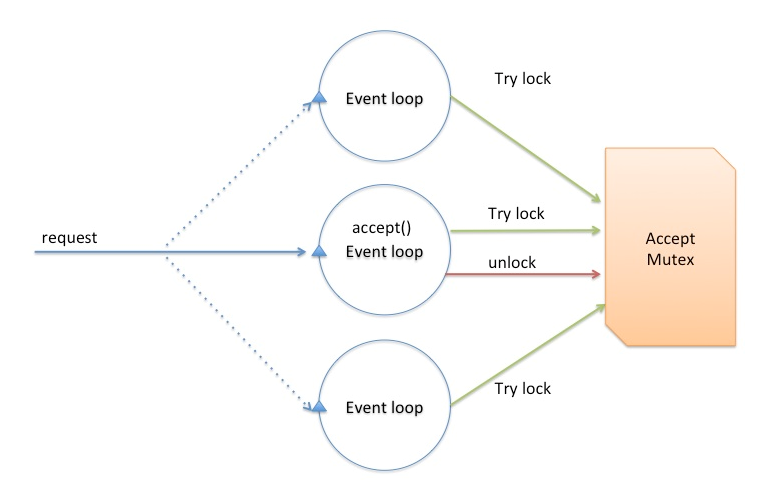
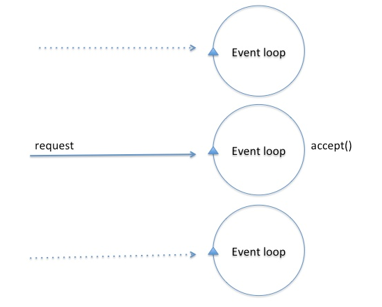

### Fastsocket建立在SO_REUSEPORT支持基础上

Linux kernel 3.9包含TCP/UDP支持多进程、多线程绑定同一个IP和端口的特性,即SO_REUSEPORT;在内核层面同时也让线程/进程之间各自独享SOCKET,避免CPU核之间以锁资源争夺`accept queue`的调用,在/kernel/include/net/sock.h定义sock_common结构时,可以看到其身影。

```c
#ifndef __GENKSYMS__
	unsigned char		skc_reuse:4;
	unsigned char		skc_reuseport:4;
#else
```

在多个socket.h文件中(如fastsocket/kernel/include/asm/socket.h),定义了SO_REUSEPORT的值:

```c
#define SO_REUSEPORT	15
```

在fastsocket/kernel/net/core/sock.c的sock_setsockopt和sock_getsockopt函数中，都有`SO_REUSEPORT`的身影：

sock_setsockopt函数中：

```c
case SO_REUSEADDR:
		sk->sk_reuse = valbool;
		break;
case SO_REUSEPORT:
		sk->sk_reuseport = valbool;
		break;
```


sock_getsockopt函数体中：

```c
	case SO_REUSEADDR:
		v.val = sk->sk_reuse;
		break;

	case SO_REUSEPORT:
		v.val = sk->sk_reuseport;
		break;
```


在`SO_REUSEPORT`特性支持之前的事件驱动驱动服务器资源竞争：




之后那,可以看做是并行的了：




Fastsocket没有重复发明轮子，在`SO_REUSEPORT`基础上进行进一步的优化等。


SO_REUSEPORT支持多个进程或者线程绑定到同一端口，提高服务器程序的性能，解决的问题：

- 允许多个套接字 bind()/listen() 同一个TCP/UDP端口
  - 每一个线程拥有自己的服务器套接字
  - 在服务器套接字上没有了锁的竞争
- 内核层面实现负载均衡
- 安全层面，监听同一个端口的套接字只能位于同一个用户下面

其核心的实现主要有三点：

- 扩展 socket option，增加 SO_REUSEPORT 选项，用来设置 reuseport。
- 修改 bind 系统调用实现，以便支持可以绑定到相同的 IP 和端口
- 修改处理新建连接的实现，查找 listener 的时候，能够支持在监听相同 IP 和端口的多个 sock 之间均衡选择。


#### CPU之间平衡处理，水平扩展

以前通过`fork`形式创建多个子进程，现在有了SO_REUSEPORT，可以不用通过`fork`的形式，让多进程监听同一个端口，各个进程中`accept socket fd`不一样，有新连接建立时，内核只会唤醒一个进程来`accept`，并且保证唤醒的均衡性。

模型简单，维护方便了，进程的管理和应用逻辑解耦，进程的管理水平扩展权限下放给程序员/管理员，可以根据实际进行控制进程启动/关闭，增加了灵活性。

这带来了一个较为微观的水平扩展思路，线程多少是否合适，状态是否存在共享，降低单个进程的资源依赖，针对无状态的服务器架构最为适合了。

### SO_REUSEPORT已知问题

SO_REUSEPORT根据数据包的四元组{src ip, src port, dst ip, dst port}和当前绑定同一个端口的服务器套接字数量进行数据包分发。若服务器套接字数量产生变化，内核会把本该上一个服务器套接字所处理的客户端连接所发送的数据包（比如三次握手期间的半连接，以及已经完成握手但在队列中排队的连接）分发到其它的服务器套接字上面，可能会导致客户端请求失败，一般可以使用：

- 使用固定的服务器套接字数量，不要在负载繁忙期间轻易变化
- 允许多个服务器套接字共享TCP请求表(Tcp request table)
- 不使用四元组作为Hash值进行选择本地套接字处理，挑选隶属于同一个CPU的套接字

与RFS/RPS/XPS-mq协作，可以获得进一步的性能：

- 服务器线程绑定到CPUs
- RPS分发TCP SYN包到对应CPU核上
- TCP连接被已绑定到CPU上的线程accept()
- XPS-mq(Transmit Packet Steering for multiqueue)，传输队列和CPU绑定，发送数据
- RFS/RPS保证同一个连接后续数据包都会被分发到同一个CPU上
- 网卡接收队列已经绑定到CPU，则RFS/RPS则无须设置
- 需要注意硬件支持与否

目的嘛，数据包的软硬中断、接收、处理等在一个CPU核上，并行化处理，尽可能做到资源利用最大化。


#### Local Listen Table

对于多核多接收队列来说,Linux原生的协议栈只能listen在一个socket上面,并且所有完成三次握手还没来得及被应用accept的套接字都会放入其附带的accept队列中,accept系统调用必须串行的从队列取出,当并发量较大时多核竞争,这将成为性能瓶颈,影响建立连接处理速度。


Local Listen Table,fastsocket为每一个CPU核克隆监听套接字,并保存到其本地表中,CPU核之间不会存在accept的竞争关系:

* 每个core有一个listen socket table.应用程序建立连接的时候,执行过程会调用local_listen()参数,有两个参数,一个是socket_FD,一个是core number,new socket从原始的listen socket(global)拷贝到per-core local socket table。这些对于应用程序来说是透明的,提供给应用程序的socketFD是抽象过得,隐藏了底层的实现。
* 当一个TCP SYN到达本机,kernel首先去local listen table中找匹配的listen socket，如果找到,就通过网卡RSS传递这个socket到一个core,否则就去global listen table中找。
* 容错方面,当进程崩溃的话,local listen socket会被关闭,进入的连接将会被引导到global Listen socket,这样的话,别的process可以处理这些连接,由于local listen socket和global listen socket共享FD,所以kernel将会把新的connect通知到对应的process.
* 如果应用程序进程使用accept()系统调用,那么处理过程是首先去global listen table中查找和操作(因为是读操作,没有使用锁)如果没找到,那么去core的local table中查找,如果找到,就返回给应用程序。由于listen的时候把socket绑定到了一个core,所以查找的时候也去这个core的local  table中查找。
* epoll兼容性 如果应用程序使用epoll_ctl()系统调用,来把一个listen socket添加到epoll set中,那么local的listen socket和global socket都被epoll监控.事件发生的时候,epoll_wait()系统调用会返回listen socket,accept()系统调用就会处理这个socket。这样就保证了epoll实现的兼容性。


#### Local Established Table

Linux内核使用一个全局的hash表以及锁操作来维护establised sockets（被用来跟踪连接的sockets）。Fastsocket 想法是把全局table分散到per-Core table，当一个core需要访问socket的时候，只在隶属于自己的table中搜索，因此不需要锁操纵，也不存在资源竞争。由fastsocket建立的socket本地local established table中，其他的regular sockets保存在global的table中。core首先去自己的local table中查找（不需要锁），然后去global中查找。


#### Receive Flow Deliver

默认情况下，应用程序主动发包的时候，发出去的包是通过正在执行本进程的那个CPU 核（系统分配的）来完成的；而接收数据包的时CPU 核是由前面提到的RSS或RPS来传递。这样一来，连接可能由不同的两个CPU核来完成。连接应该在本地化处理。RFS和Intel网卡的FlowDirector可以从软件和硬件上缓解这种情况，但是不完备。

RFD（Receive Flow Deliver）主要的思想是CPU核数主动发起连接的时候可以把CPU core的标识和连接的source port编码到一起。CPU cores和ports的关系由一个关系集合来决定[cores，ports]， 对于一个port，有唯一的一个core与之对应。当一个core来建立connection的时候，RFD随机选择一个跟当前core匹配的port。接收包的时候，RFD负责决定这个包应该让哪一个core来处理，如果当前core不是被选中的cpu core，那么就deliver到选中的cpu core。

一般来说，RFD对代理程序收益比较大，单纯的WEB服务器可以选择禁用。


Fastsocket的努力，在单个TCP连接的管理从网卡触发的硬中断、软中断、三次握手、数据传输、四次挥手等完整的过程在完整在一个CPU核上进行处理，从而实现了每一个CPU核心TCP资源本地化，这样为多核水平扩展打好了基础，减少全局资源竞争，平行化处理连接，同时降低文件锁的副作用，做到了极为高效的短连接处理方案，


