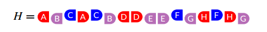

建模系统执行是一系列的action,action要么是invocation(调用),要么是response(响应),在操作系统的上下文中,invocation代表系统调用和参数(例如getpid()),response代表返回的响应结果(如PID),invocation和response是成对出现的.

一个action包含以下几个部分

* operation class(操作类)(系统调用被触发)
* operation arguments(调用参数)(针对invocation)与return value(返回值)(针对response)
* relevant thread(相关线程)
* a tag for uniqueness(唯一性标签)

left half-circles   (invocation A)

right half-circles (respond A)

 颜色和偏移位置代表不同线程。

Example:

## 交换性 (commutativity)

一组操作在某些上下文中commute,当specification对集合的执行顺序无关时。

意味着任意response只要对commutative集合中的一个顺序合法,那么对可交换集合中的任意顺序都合法。

同样, 对一个无效,对任意顺序都无效。

||连接动作序列

H=X || Y

Y **SI-commutes** in H 当任意reordering Y’ of Y,任意动作序列 Z:

​	X|| Y || Z  $\in$    if and only if X || Y‘ || Z $\in$   

基于接口(interface basis)和状态依赖(state dependence)

Y与Y'的切换要求Y的返回值合法,顺序无关。

Z的存在要求未来操作对Y的 reordering 没有影响。

monotonic:单调性

Y SIM-commutes in H=X || Y,当对一些reordering Y的任意前缀P(P=Y), P SI-commutes in X ||P

## Rule

假设一个$specification \ \zeta$带有M的正确引用实现,H=X||Y, 在H中Y是SIM-commutes,并且M能生成H,那么存在$\zeta$ 的正确实现m,在H中Y的实现是内存不冲突的。

#### 理解：就是在一个可扩展的接口,提供一个实现(任意实现,不一定可扩展),然后存在一个实现让这个接口在Y区域内能够不冲突。(注意Y要是commute的,open文件那个不一定是commute的)

## Proof

分别根据reference M构造了$m_{ns}$的non-scalable和scalable实现。

scalable实现中,commutative区域中每一步m仅访问调用线程的状态组件,non-scalable中是访问history。这意味着commutative region中任何两个步骤都是无冲突的。所以证明了交换性规则。

#### scalable

当通过H'初始化reference implementation状态时,该构造使用SIM交换。如果观察到的调用在commutative  region之前分歧,H'将完全等于观察到的调用。假如发生在commutative region之内或之后,将会没有足够的信息来恢复调用顺序(s.h[t]组件跟踪每个线程发生的调用,但不是线程之间调用的顺序)。因此H'可能会重新排序Y中的调用。SIM commutativity保证replaying H‘仍然会产生与实际调用顺序一样的结果,即使执行在commutative region内部有分歧。

#### non-scalable

当输入调用与H匹配时,$m_{ns}$根据H可以精确响应,而没必要调用reference,当输入调用与H有分歧时,$m_{ns}$不知道如何响应,所以会进入EMULATION模式,这**需要告诉M所有以前收到的调用以准备其状态(所以说一旦出现分歧的时候,是把所有之前的状态都要feed给M)**。

$m_{ns}$的状态包含两个组件,首先,s.h保留一部分需要被replayed或EMULATE(emulation mode,被初始化为H)的H的部分。s.refstate是reference implementation的状态,并进行相应的初始化。Figure 1做了几个假设:$m_{ns}$以有限的方式收到CONTINUE调用。

H consistent with s.h：当输入序列有分歧时,此步骤计算H的前缀,但不包含s.h中去了response的部分，并根据需要添加CONTINUE.

对任意history的响应总是与reference implementation相匹配,但是不可扩展。***在replay mode下,任意两个步骤在访问s.h的时候会发生冲突,这些访问跟踪发生了哪个调用。假如没有他们,以后不可能初始化M的状态**。**这就是commutativity产生的原因(所以说，这句话的意思是只有在replay mode的情况下才会出现scalable????)***。 SIM-commutative region中的动作顺序并不重要。因为$specification$不根据顺序区分,所以可以安全的使用与收到的顺序不同的顺序来初始化reference implementation。根据$specification$,所有未来的响应仍是合法的。

#### 理解

所以其实它是在replay mode的时候可以scale?

### 专业名词:

$history$: a system execution 一个系统执行。

$specification$: distinguishes whether or not a history is "correct".区分history是否正确

$specification \ \zeta$:prefix-closed set of well-formed histories

   

