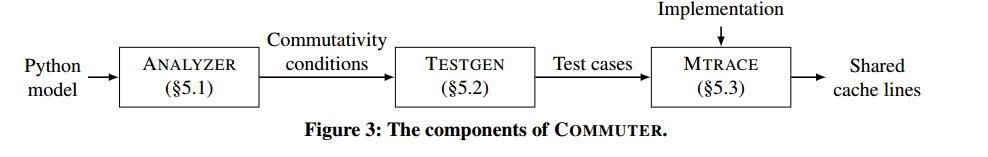
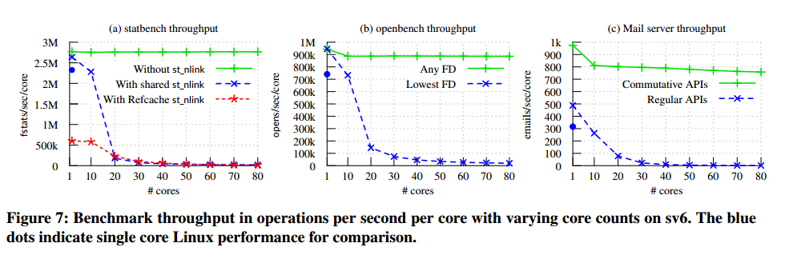

# 可扩展交换规则：为多核处理器设计可扩展软件

## Summary of major innovations(重大创新)

当执行接口设计好之后,会以一种简单地方式实现，这套规则帮助开发人员从接口设计开始设计更高可扩展的软件,并通过实现，测试和评估进行。为了帮助开发人员应用规则,一个叫做COMMUTER的工具设计出来帮助测评高层接口模型并且生成测试用例来评估实现的可扩展性。

本文从更高层次提出了一种新的可扩展性方法：软件接口。这使在实现以及必要的用于度量的硬件可用之前去推测可扩展性成为可能。它可以突出显示固有的可扩展性问题，并且提出可代替的接口设计，为实现可扩展接口设置了一个明确的可扩展目标。

可扩展性通常被认为是一个实现属性而不是接口属性，假设具有使用MESI类协议保持高速缓存一致的共享存储多核处理器，那么通用的可扩展性参数是可能的，在这样的处理器上，核可以可扩展的读取和写入已经独占的缓存数据，并且可扩展的读取已经已共享模式缓存的数据，但是，由于相关协议对每个高速缓存行的所有权更改进行了序列化，并且因为共享互联可能将不相关的传输序列化，编写上一次由另一个核读取或写入的高速缓存行不可扩展。

因此作者认为一组操作的实现具有冲突的空闲内存访问的，没有核写入另一个核读取或写入的高速缓存行，那么实现可扩展，当内存访问无冲突时，增加越多的核会产生线性的容量增长，这不是现代硬件复杂现实中的完美模型，但是是一种很好的近似。作者的方法的核心便是这种可扩展的交换规则：在任何情况下，几个操作都有可能并行执行——这意味着没有办法使用接口区分其执行顺序——他们的实现中内存是不冲突的，更通俗的说，**每当接口操作通勤(commute)，他们都可以以扩展的方式实现**。**作者通过可交换性(commutativity)来推理可扩展性(scalability)**。

交换性规则直观意义为：当操作通勤时，他们的执行结果(返回值和对系统状态的影响)与顺序无关。交换操作之间的通信是不必要的，并且消除它实现无冲突。

### SIM交换性

交换性的通常定义非常严格(例如代数运算)，很少适用于系统软件中常见的复杂状态接口，SIM交换性是状态依赖和基于接口的，并且还是单调的。当操作在特定系统状态，特定操作参数和特定并发操作的上下文中通勤时，存在针对该状态和这些参数以及并发操作无冲突的实现。这使得将规则应用于实际接口的机会更多，从而发现可扩展的实现，而不是传统的交换型概念。尽管其逻辑状态存在依赖性。SIM交换性是基于接口的：而不是要求所有操作命令产生相同的内部状态，但是需要接口不可区分的结果状态，因此，SIM交换性独立于任何特定的实现，使开发人员能够将规则直接应用于接口设计。

### 可交换的接口设计

* 分解复合操作:许多POSIX API将多个操作组合成一个操作，限制了组合操作的交互性。
* 接受规范中的非确定性：POSIX的"最低可用FD"规则是过度确定性的典型例子，导致扩展性差。
* 允许弱有序：操作之间的严格排序要求。 例如通信接口执行严格有序是不必要的，
* 异步释放资源：POSIX操作具有操作返回之前必须可见的全局效果，但是对于释放资源的操作，这通常比应用程序更严格，而且更昂贵。

### 以测试为导向的工具 COMMUTER

组件:

* ANALYZER: 自动化分析接口的交互性过程，从而避免了开发人员考虑复杂操作之间大量交互的繁琐且容易出错的过程。将接口的行为模型作为输入，以Python的符号变体形式输入，并输出交换条件：当操作集合通勤时的表达式的参数和状态。开发人员可以检查这些表达式以了解接口的交换性，或者将它们传递给TESTGEN。 ANALYZER考虑到一定大小的每一组操作，对于每组操作o,为o中的每个操作构造一个无约束的符号系统状态s和无约束的符号参数，并且执行o的所有排列，每个从s的副本开始。这种执行在任何可以同时进行的分支上分叉，构建限制状态的路径条件和可导致每个代码路径的参数。在每个代码路径的末尾，ANALYZER检查其路径条件是否产生初始状态，并且通过测试使得每个操作的返回值在所有排列中是等效的，并且如果所有排列达到的系统状态是相等的(或可以等同于某些非确定性值的选择，如新分配的索引节点号)。对于大于对的集合，ANALYZER还必须检查中间状态对于o的每个子集的每个排列是等效的。
* TESTGEN:通过将ANALYZER的交换条件转换为具体的测试用例，来帮助开发人员实现实际交换。为了产生测试用例，TESTGEN为相应的交换条件计算一个令人满意的赋值。为模型中的每个符号变量制定具体值。测试用例包括确定系统的初始状态和一组在不同内核上运行的功能的设置代码。 每个TESTGEN测试用例都应该有一个无冲突的实现。这些测试用例的目标是实现中暴露潜在的可扩展性问题，但是TESTGEN无法准确的知道什么输入可能触发内存访问。因此，作为实现良好覆盖的代理，TESTGEN旨在实现对Python模型的良好覆盖。考虑两种形式的覆盖：
  * 标准的路径覆盖，TESTGEN依靠ANALYZER的符号执行来实现，为操作可能的每个代码路径生成单独的路径条件。然而，即使一个路径也可能会以有趣的方式遇到冲突。例如，无论他们写入相同的偏移量还是不同的偏移量，通过两个模式的代码路径是相同的，但访问模式不同。
  * 冲突覆盖：捕获不同的条件以及路径条件，在共享数据结构上执行可能的访问模式，TESTGEN从ANALYZER的路径条件的约束开始，跟踪由模型特定的测试代码生成器强制到具体值的每个符号表达式，否定这些表达式与路径条件的任何等效分配，并生成另一个测试，重复此过程直到排出满足路径条件或SMT求解器失败的分配。
* MTRACE: 运行由TESTGEN生成的测试用例，并在每个测试中检查实现是否无差错，如果违反了交换规则，会报告哪些变量被共享，哪些变量被访问。

## What the problems the paper mentioned?(提到的问题)。

可不可以在任何实现设计出来之间,通过考虑接口设计规范来判断能否实现可扩展？

当前评估多核软件的可扩展性是选择工作负载，绘制不同数量内核的性能，并使用差异性分析(differential profiling)等工具来识别可扩展性瓶颈。这种方式存在缺点：不同的工作负载或者略高的核数量会引进新的瓶颈。而这种瓶颈不是显而易见的，所以开发者可能意识不到存在可扩展的解决方案，等到发现瓶颈的时候一切都晚了，因为设计级解决方案(如改进接口)可能是不切实际的。

实践者经常采取迭代过程来提高可扩展性：设计，实现，测量，重复。然而Linux仍然存在很多可扩展性瓶颈，并且缺乏关于接口级可伸缩性的推理方法，目前还不清楚其系统调用接口固有的瓶颈。

## How about the important related works/papers?(相关工作论文的重要性)

引用的很多文献中已经确定了交换性和并发性之间的联系。

论文2介绍了订单规则探讨了接口间的强交换性与其实现是否需要原子指令或栅栏之间的正确并发执行之间的关系。

论文3,43介绍了用于多核处理器的多核器件旨在通过避免内核中的共享数据结构来实现可扩展性，这些系统在消息传递之上使用分布式系统技术(如名称缓存和状态复制)实现共享抽象。

论文16,21介绍了可扩展引用计数器，交换性规则建立在这种理解上，并且在任意接口可以避免内存冲突访问。

论文25介绍了不相交并行内存系统。如果共享内存系统是不相交访问并行的，并且一组进程访问不相交的内存位置，则这些进程可以线性增加或减少。类比于交换规则，这是一个可扩展性保证的条件。

论文32介绍了MCS锁的设计，通过避免特定高速缓存线的争用，消除了可扩展性崩溃。

论文36介绍了不相交共享进程的可扩展性，例如共享高数缓存行上的比较和交换指令或共享锁。

论文29描述了差异性分析。

## What are some intriguing aspects of the paper?

可扩展的交换规则为开发者提供了一种新的方法，利用多核扩展。定义了SIM交换性，允许开发人员将规则应用于复杂的状态接口。

## How to test/compare/analyze the results?

* 7(a)展示了以两种模式运行statbench:一种模式使用fstat,不与线程执行的链接和解除链接的操作通信，另一种模式使用fstatx请求除链接计数(一个与链接通勤的操作)之外的所有文件，使用Refcache可伸缩计数器作为链接计数，以便链接和解除链接不会混淆，以将其放在自己的缓存行上，以避免虚假共享。图显示了结果。通过交换fstatx,statbench可以很好地扩展，并在fstatx中经历二级缓存零缺失，而fstat严重限制了statbench的可扩展性。
* 图7（b）显示了openbench的结果，它强调了open打开的文件描述符分配。在openbench中，n个线程同时打开和关闭每个线程文件。这些调用不会通勤，因为每次打开都必须在进程中分配最低的未使用的文件描述符。对于许多应用程序，可以返回任何未使用的文件描述符（在这种情况下，打开的调用通勤），所以sv6添加一个O_ANYFD标志来打开它，它使用FD空间的每个核分区来实现。 与statbench非常相似，标准的非交换式开放接口限制了开放架构的可扩展性，而O_ANYFD的开放式架构线性可缩放。 此外，有或没有O_ANYFD，ScaleFS的开放似乎没有任何性能损失：在一个核上，这两种情况都是相同的，比Linux的open操作性能高出27％。 一些性能差异是因为sv6不实现权限检查，但是Linux的大部分开销来自ScaleFS避免的锁定。
* 微基准测试中,在两个配置中运行邮件服务器：一个使用最低的FD,用于队列通知的保留套接字。并且使用fork/exec生成辅助进程，一个使用O_ANYFD，一个无序的通知套接字并且使用posix_spawn。对于队列通知，使用Unix域数据报套接字; sv6在有序模式下实现单个共享队列，并以无序模式实现可扩展负载均衡的per-core消息队列。最后，由于fork在同一进程中基本上没有其他操作，所以sv6通过直接构建新的进程映像并构建新的文件表来实现posix_spawn。这种实现与大多数其他操作无关，包括对O_CLOEXEC文件的操作。图7(c)显示了这两个测试结果的可扩展性。尽管邮件服务器执行的操作比微基准更广泛，并不仅仅局限于非交换操作，但结果非常相似。非交换操作导致基准测试的吞吐量在少量内核中崩溃，而使用交换API的配置可实现从1个插槽（10个内核）到8个插槽的7.5倍可扩展性。