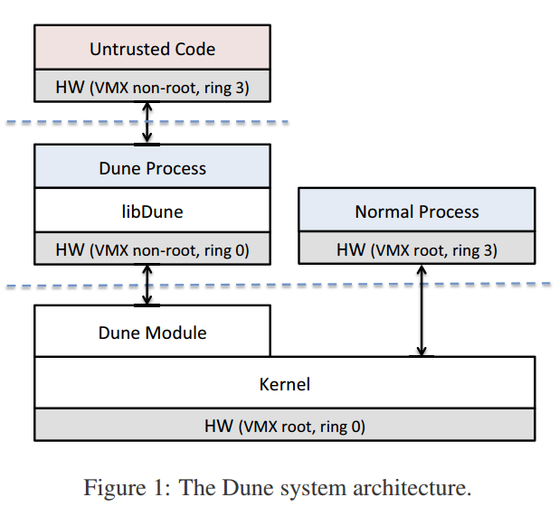
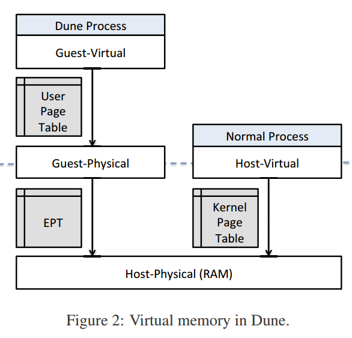
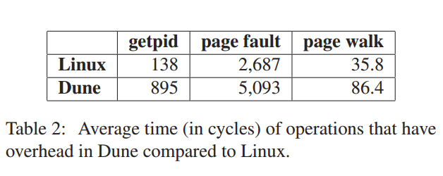
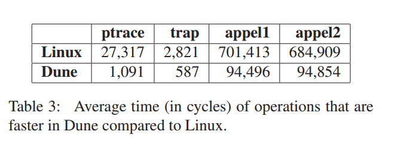

# 安全的用户级访问特权CPU功能

​	Dune是一个为应用程序提供直接并且安全访问硬件功能的系统，例如环保护，页表和标记TLB。同时保留现有的操作系统进程接口。Dune使用现代处理器中的虚拟化硬件来提供一个进程,而不是机器抽象。它包含一个小的内核模块用来初始化虚拟硬件并且调停与内核交互，还包含一个用户级库用来帮助应用程序管理特权硬件功能。

​	使用Dune实现三个可以从访问特权硬件中获益的用户级程序：

* 用于不受信任代码的沙盒
* 特权分离工具
* 垃圾收集器

使用Dune可以大大简化这些应用的实现，并提供显著的性能优势。Dune的核心是管理VT-x的内核模块，并向用户程序提供对特权硬件功能的更大访问。

Dune架构，Dune使用启用VT-x的模块扩展内核，将内核置于VMX根模式。使用Dune的进程通过在VMX非根模式下运行，可以直接但安全的访问特权硬件。Dune模块拦截VM退出，这是Dune进程访问内核的唯一方法，并且执行任何必要的操作，如在HLT指令后维护页错误，调用系统调用或释放CPU。

## Summary of major innovations(重大创新)

### 综述	

​       这篇文章介绍了一种新的应用程序使用内核硬件特性的方法:使用虚拟化硬件提供一个过程，而不是机器抽象。作者在Dune系统中为64位的intel CPU实现了这种方法，Dune提供了一个可加载的内核模块，可以与未修改的Linux内核一起工作，该模块允许进程进入"Dune模式"，这是一种不可逆的转换，通过虚拟化硬件启用对特权硬件功能的安全快速访问，包括特权模式，虚拟内存寄存器，页表和中断，异常和系统调用向量。作者还提供了一个用户级库，以方便这些功能的使用。

为了适合其应用场景，Dune提供了几个优于虚拟机的优点：

* Dune进程是一个普通的Linux进程，唯一的区别是它使用VMCALL指令调用系统调用。这意味着Dune进程可以完全访问系统的其余部分。
* Dune应用程序易于开发(应用程序编程，而不是内核编程)
* 因为Dune内核模块不试图提供机器抽象，所以模块可以更简单和更快。
* 虚拟化硬件可以被配置为避免保存和恢复虚拟机所需的若干硬件状态。

Dune使用VT-x为用户程序提供对x86保护硬件完全访问。包括三个硬件功能：异常，虚拟内存和权限模式。

* 在例如仿真，调试和性能追踪的各种使用情况中，对异常的有效支持很重要，通常向应用程序报告异常需要特权模式转换和上调机制(例如信号)，Dune可以减少异常开销，因为它使用VT-x直接在硬件中传递异常。但是这不允许Dune进程独占CPU，因为定时器中断和其它内核相关的异常仍将导致VM退出，最终结果是消除了软件开销，异常性能仅由硬件效率确定。与Linux的SIGSEGV相比，Dune将了页面错误异常的速度提高了4倍以上，还加速了其它类型的异常，包括断点，浮点溢出和下溢，除以0和无效操作码。
* 用户程序也可以受益于快速和灵活的访问虚拟内存。用例包括检查点，垃圾收集，数据压缩分页和分布式共享内存。Dune通过将页表条目直接暴露给用户程序来改进虚拟内存访问，允许他们使用简单地内存引用控制地址转换，访问权限，全局位和修改/访问位。
* Dune还为用户程序提供手动控制TLB无效的能力，因此，当应用程序允许时，页表更新可以批量进行。这在内核中支持相当困难，因为当必须保持一般正确性时难以推迟TLB无效。此外，Dune通过提供对英特尔最近添加的流程上下文标识符(PCID)功能的访问，暴露了TLB标记。这允许单个用户程序有效的在多个页表之间切换。总而言之，使用Dune在Appel和L用户级虚拟内存基准测试中，结果是Linux的7倍速度。
* Dune暴露访问权限模式，在x86上，最重要的权限模式是环0(管理员模式)和环3(用户模式)，但环1和环2也可用。两种令人激励的特权模式的用例是特权分离和不可信代码的沙盒。Dune可以有效地支持特权模式，因为VMX非根模式维护自己的一组特权环。因此，Dune允许进程内的硬件强制保护内核免受用户进程的影响，页表中的管理程序可用于控制存储器隔离，此外，系统调用指令陷阱到(trap to)进程本身,而不是内核，其可以用于系统调用插入，并且防止不可信代码直接访问内核，与Linux的ptrace相比，Dune可以拦截一个系统调用，减少25倍的开销。

### 与VMM比较

虽然所有使用VT-x的软件都有一个共同的结构，但是Dune对VT-x的使用偏离了标准的VMM,具体来说，Dune暴露了一个过程环境而不是机器环境。Dune不能支持正常的客户操作系统，但这会使Dune更加轻量级和灵活，一些显著的差异如下：

* Hypercall是VMM支持版虚拟化的常用方法，其中客户操作系统被修改为使用更高效且难以虚拟化的接口，相比之下，在Dune中，Hypercall机制调用正常的Linux系统调用，例如，VMM可以提供Hypercall调用来为虚拟网络设备注册中断处理程序,而Dune进程将使用Hypercall来在TCP套接字上进行读取。
* 许多VMM模拟物理硬件接口，以支持未修改的客户操作系统。在Dune中，只有可以在没有VMM干预的情况下直接访问的硬件功能被设置成可用;例如，大多数VMM花费很大的时间来呈现虚拟图卡接口以便支持帧缓冲器，相比之下，Dune进程采用正常的OS显示服务，通常是使用X服务器通过Unix域套接字和共享内存访问实现。
* 典型的VMM必须保存和恢复支持客户机操作系统所需的所有状态，在Dune中，我们可以限制客户和主机状态的差异，因为使用Dune的具有较窄的硬件接口。这将会减少执行的VM条目和VM退出的开销。
* VMM将每个VM放置在模拟物理内存的单独地址空间中，Dune中，配置EPT来映射进程地址空间，因此，当两个进程映射同一个内存段时，存储器布局可以是稀疏的， 并且可以共享内存。

### 内存管理

内存管理是Dune模块最大的责任之一，面临的挑战是直接暴露页表给用户程序，并且要阻止对物理内存的任意访问。此外，Dune的目标是默认提供一个正常的进程内存地址空间，允许用户程序只添加他们需要的功能，而不是完全替换内核级内存管理。

如图2所示，分页转换发生在三种不同的情况：

* 一个转换由内核的标准页表指定，这是主机——虚拟 到主机——物理(原始内存)的转换，主机——虚拟地址是普通虚拟地址，但他们仅由内核和正常进程使用。
* 对于Dune进程，用户页表 将客户——虚拟地址映射到客户——物理地址。
* 由内核管理的EPT执行从客户物理地址到主机——物理地址的附加转换。

由使用Dune的进程完成的所有内存引用都只能是客户——虚拟地址，允许在EPT中实施隔离和正确性检测，而应用程序特定的功能和优化可以应用在用户页表中。

作者希望将EPT和内核的页表尽可能匹配，这样便可以使用Dune访问与正常进程相同的地址空间，如果它被硬件允许，可以将EPT和内核的页表指向同一个叶根。然而，两个限制使之不可能：

* EPT需要与标准x86页表不同的二进制格式
* Intel x86处理器将客户——物理地址的地址宽度限制为与主机——物理地址相同。在标准虚拟机环境中，不会有问题，因为任何被仿真的机器都具有有限的RAM数量，然而，对于Dune来说，Dune想暴露完整的主机——虚拟地址空间，而客户——物理地址空间被限制为较小的大小

解决方案：

* 对EPT格式不兼容的解决方案是查询内核的进程内存映射，并手动更新EPT以反映他们，从一个空的EPT开始，然后每次访问丢失的EPT条目时，都会收到一个EPT故障(一种类型的VM退出)。故障处理器制作一个新的EPT条目，反映由内核的页错误处理程序报告的地址转换和许可。有时，地址范围需要取消映射，此外，内核需要页面访问信息，以帮助交换和和处理页面脏状态，以确定何时需要写回磁盘，Dune通过挂钩到MMU通知程序链来支持这些情况，KVM使用的方法相同，例如：当地址未映射时，Dune模块接收事件，然后它驱逐受影响的EPT条目并在适当的EPT页面结构中设置脏位。
* 通过仅允许在EPT中映射一些地址范围来解决地址宽度问题。具体来说，只允许从进程的开始(即堆，代码和数据段)，mmap区域和堆栈的地址。现在，将这些区域限制为4G，允许压缩地址空间以适应EPT的前12GB，通常，用户的页表将地址扩展为其原始布局。这可能导致使用地址空间的非标准部分的程序不兼容，尽管这种情况很少见。更复杂的解决方案可以以任意顺序将每个虚拟内存区域包装到客户——物理地址空间中，然后向用户程序提供该段映射到自己的页表中的正确客户——虚拟地址，从而避免不可寻址内存区域的可能性。

### 暴露对硬件的访问

Dune暴露了对异常，虚拟内核和权限模式的访问。异常和权限模式在VMX非根模式中隐式可用，不需要任何特殊的配置，虚拟内存需要访问%CR3寄存器，这可以在VMCS中授予，Dune为每个进程维护单独的VMCS，以允许每个进程配置特权状态并且可以更容易和有效的支持上下文切换。

出于性能原因，Dune限制对硬件寄存器的访问。例如，Dune不允许修改MSR，以避免在每次系统调用期间保存和恢复他们带来的相对较高的开销，FS和GS基地址寄存器是异常。因为他们不仅频繁使用，而且还由硬件自动保存和恢复。MSR LSTAR包含系统调用处理器程序的地址，是一种特殊情况，其中Dune允许只读访问。这允许用户进程在现有地址处映射用于系统调用处理程序的代码(通过操纵其页表)，而不是将寄存器改变为新地址，导致降低性能。

Dune暴露对时间戳计时器(TSC)的原始访问。

### 保存操作系统接口

Dune保存了对OS系统调用的访问。正常的系统调用指令只会在进程本身内捕获，并且不会导致VM退出，并且，进程必须使用VMCALL(超级调用指令)来进行系统调用。

Dune完全改变了如何调用信号处理程序，一些信号通过更有效的直接硬件支持来消除。例如，硬件页错误大多包含SIGSEGV的作用。对于其他信号(如SIGINT),Dune模块向进程中注入伪硬件中断。这不仅是一种有效的机制，而且还具有正确构成权限模式的优点。例如，如果用户进程在环3中运行到沙箱中不受信任的代码，硬件将自动将其转换到环0，以便安全的服务信号。

### 限制

* 还没有完全集成对信号的支持。
* 虽然支持pthread，但是libDune中的一些实用程序(如页表管理)还不是线程安全的。
* 无论如何设置客户——虚拟映射，系统调用参数必须是有效的主机——虚拟地址
* 通过暴露对特权硬件的更大访问权限，用户程序需要更多地特定于体系结构的代码，从而潜在的降低了可移植性。

### 垃圾收集器

* 快速故障：修改了Linux内存保护和映射源语以大大提高性能，其中一部分包括允许硬件异常绕过内核并由用户模式直接处理。
* 批量页表：启用了TLB无效的显式控制和影子页表，以公开用于批处理页表的准备和提交样式API。
* 粉碎/修复：使大页面被“粉碎”成小页面或一组小页面，以“修复”成单个大页面。
* 免费物理框架：当C4收集器释放底层物理框架时，它将捕获对未映射的虚拟页面的访问，以捕获旧的引用。

### 性能

Dune的性能受两个主要开销的影响。

* VT-x增加了进入和退出内核-VM条目的成本，并且VM退出比快速系统调用指令或异常更昂贵。系统调用和其它类型的故障(如页错误)必须在Dune中付出固定成本。
* 使用EPT使得TLB miss更昂贵。一些情况，硬件页面找寻必须遍历两个页表。

## What the problems the paper mentioned?(提到的问题)。

一些系统需要在内核中做点改变，来实现某些功能，但是因为用户空间中对硬件访问有着安全和隔离原因的限制,同时，修改内核在实践中是不理想的，因为修改内核可能会影响整个系统的稳定性。另一种策略是将应用程序捆绑到具有专用内核的虚拟机映像中,许多现代化CPU包含虚拟化硬件，客户操作系统可以安全高效的访问内核硬件功能，此外，虚拟机提供类似于进程的故障控制，即错误和恶意性能不能使整个物理机器荡掉。不幸的是，虚拟机与主机操作系统的集成很差，进程期望从父进程继承文件描述符，产生其他进程，与其父进程和子进程共享文件系统和设备，并使用IPC服务。为了例如加速垃圾收集等目的，将进程移动到虚拟机可能会破坏很多假设，并且可能根本不值得如此麻烦，此外，为应用程序特定的虚拟机生成内核不是小任务。生产内核很复杂，并且很难修改，而且实现具有简单虚拟存储器层的专用内核也是具有挑战性的，除了虚拟内存之外，还必须支持文件系统，网络协议栈，设备驱动程序和引导过程。

## How about the important related works/papers?(相关工作论文的重要性)

论文5介绍了用户程序也可以受益于快速和灵活的访问虚拟内存。

论文7介绍了被SPIN项目采纳的方法，允许应用程序安全的将扩展直接加载到内核中。

论文13介绍了通过在Linux进程中运行IOMMU硬件来安全隔离恶意设备驱动程序。

论文15指出了Azul Systems通过使用分页硬件使垃圾收集器显著加速。

论文18介绍了Exokernel通过低级内核接口暴露了硬件功能，允许应用程序直接管理硬件资源。

论文20介绍了Fluke项目在软件中支持嵌套过程模型，允许OS“垂直”构建。Dune补充了这种方法，因为它可以用于通过使用特权模式在应用程序和内核之间有效的支持额外的OS层硬件。但是Dune公开的硬件只能支持单个级别，而不是Fluke中提供的多个级别。

论文29描述了VT-x已被建议作为创建rootkit的工具。

论文31指出了VT-x受IBM解释执行架构的启发，把尽可能多的指令，包括大多数访问特权状态，直接在硬件中执行，而没有来自VMM的干预。因为硬件维持特权状态的“卷影副本”，这种方法的动机是提高性能，因为陷阱是重要的开销源。

论文32和论文40指出了过程迁移虽然在用户程序中实现，但会受到页错误和系统调用的显著影响。

论文39指出平均SPEC2000开销为5%，最坏情况下的性能为12%,而Dune中的相同基准，可以实现几乎为0的平均开销(最差情况为1.4%)。

## What are some intriguing aspects of the paper?

* 为了保持对内核的更改尽可能不被干扰，开发了Dune作为动态可加载的内核模块，实现基于KVM，共享用于管理低级VT-x操作的代码。但是高级代码不与KVM共享，因为Dune与VMM操作不同。代码只有2509行。从论文上来说，感觉实现的东西挺多，但是代码行数很少，可以根据代码对论文进行更深一步的研究。
* 能够同时支持数千个进程。因为使用Dune的进程比完全虚拟机轻量级的多，通过使用虚拟处理器标识符(VPIDs)进一步提高效率,VPID使得能够将唯一的TLB标签分配给每个Dune进程，因此，超级调用和上下文切换不需要TLB无效。

## How to test/compare/analyze the results?

通过列表，展示了对于系统调用,页面错误,页表查询这些操作的性能会降低，为前文介绍性能会降低提供了资料，展示了降低的数据。同时论文还详细描述了测试对比的环境以及详细过程，比较有说服力。

介绍了Dune对一些操作做了优化，介绍了优化方法，同时提供了测试结果用以验证优化的成功性。

后面的一些比较大多也是列表格不一一介绍了，而且没有详细指出原因，但是很多数据感觉列出百分比会加强说明。

## How can the research be improved?

例如内存管理那一节里，分析了问题原因在哪，然后提出了解决方案。

## If you write this paper, then how would you do?

我感觉论文结构挺好，每个地方会先指出当前系统的不足之后，以对比的手法指出相同的事情在Dune中是怎么样做的，我会再去类比一些生活中的例子，感觉很多东西没有接触过，看懂不太容易。

## Did you test the results by yourself? If so,What’s your test Results?

论文中给的git链接貌似挂了。

## Give the survey paper list in the same area of the paper your reading.(读过的相同领域论文列表)