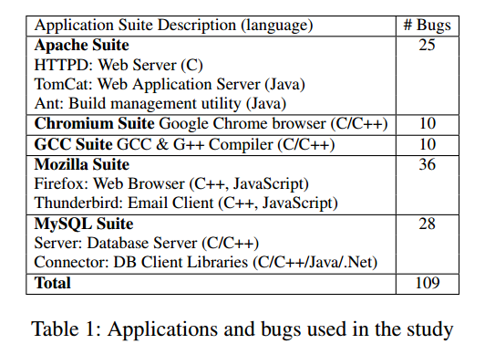

## Understanding and Detecting Real-World Performance Bugs(理解和检测现实世界中的性能bugs)

​	开发者经常使用的低效代码可以通过一些简单的补丁修复。这些低效的代码可能会导致性能的显著下降和资源浪费(称为performance bugs)。多核时代单线程的性能有所增加,对能效(energy efficiency)的关注越来越多，需要更多地努力解决performance bugs.

​	论文对五个代表性软件(Apache,Chrome,GCC, Mozilla和MySQL)随机抽样的109个真实世界中的performance bugs进行了全面研究,研究结果有助于未来工作中避免,暴露，检测并修复performance bugs.

## Summary of major innovations(重大创新)

#### Characteristics Study(特性研究)

对performance bugs和错误认知的了解不足,例如"性能受编译器和硬件照顾",是导致性能问题的部分原因。缺乏关于"如何引入性能错误","什么样的输入条件对暴露performance bugs是必要的"，"现实世界performance bugs的常见根源",“开发人员如何修复performance bugs”等主题的实证研究,严重限制了性能避免,测试,检测和修复工具的设计。

这篇论文是第一个根据五个代表性的开源软件套件的错误数据库随机收集的109个错误,全面研究了现实世界的performance bugs.这篇论文得出以下结论:

* guidance for bug avoidance:$\frac{2}{3}$的错误因为开发人员的工作负载和API性能特点的错误理解导致的,超过$\frac{1}{4}$的错误来自以前正确的代码,因为工作负载和API更改导致错误。为了避免performance bugs,开发者需要面向性能的注释系统和分析变更带来的影响。 
* guidance for performance testing:几乎一半的错误需要特殊feature和大规模的输入才能发现。新性能测试方案将功能测试和面向大规模数据量结合起来生成输入,将显著改善现有技术。
* guidance for bug detection:作者研究发现了现实世界性能错误的常见根本原因和结构模式,可以帮助提高性能错误检测的覆盖率和准确性。
* guidance for bug fixing and detection:几乎一半的错误检查补丁包含可重用的效率规则可以帮助检测和修复性能错误。
* Comparison with functional bugs:性能错误往往比功能缺陷更难发现,性能错误不能被模拟为罕见的事件,可能所有输入都可以触发部分性能错误。
* General motivation:
  * 许多性能错误补丁很小,可以通过更改几行代码实现性能的显著改进
  * 多线程软件中的性能错误很多与同步有关,开发人员需要工具支持避免过度同步陷阱。

#### Bug Detection(错误检测)

假设:

* 效率相关规则存在
* 可以从性能错误补丁中提取规则
* 可以使用提取的规则来发现以前未知的性能错误。

确认了效率规则的存在和价值,作者研究的一些效率规则经常在多个地方被多个开发人员在多个程序中违反,坐着的经验将会激励一些未来的工作:通过新的补丁语言,自动补丁分析,源代码分析或以性能为导向的注释自动生成效率规则,未来的工作还可以通过静态检查,动态分析,工作负载监控等提高性能检测的准确性。

#### 例子

* **Transparent Draw:** 开发者开发了nsImage::Draw来实现图片缩放,合成和渲染,对于透明图像是一种浪费。直到两年后开发者大量使用1*1的透明图片来调整布局才修复了这个bug。
* **Intensive(密集) GC:** 在Web 2.0之后GC边的很频繁,导致Firefox比Safari多10倍的CPU时间。
* **Bookmark All:**每个bookmark最开始采用一个事务处理,后来添加了API,可以一个事务处理多个书签。
* **Slow Fast-Lock:** MySQL开发者提供了一个fastmutux_lock以更快加锁,却发现比正常的加锁慢40倍,因为库函数random()保留了一个锁,通过替换random()位非并发的随机数生成器修正了这个Bug.

#### 得出以下结论:

* 它们与传统的错误相似,例如：它们都与功能/API的使用规则相关,这是以前关于检测功能缺陷的工作所研究的主题。
* 2-4中的错误是代码段在写入之后一段时间之后才变成了bug,这对于功能缺陷来说是罕见的。
* 开发人员自己可能发现不了这些bugs,他们无法预测未来的工作负载或者代码更改,以避免透明绘图,密集GC,保存全部书签等错误,即使是同步库的专家也不能避免Slow Fast-lock这种错误。因为给出的API不透明,而且具有意想不到的性能特征，这里需要研究和工具支持。

### Characteristics Study(特性研究)

#### root Causes of Performance Bugs

提供对现实世界performance bugs的基本理解并且给出bug detection研究的指导。

目标：不是发现以前没有听到过的根本原因,而是检查是否存在bug检查可以集中关注的现实世界performance bugs中的常见root-cause模式。

研究发现,大多数现实世界的性能错误只有几个根本原因类别,常见模式确实存在,性能经常在调用站点(call sites)和功能边界(function boundaries)上损失。如下：

*  **Uncoordinated functions**(不协调的功能):超过$\frac{1}{3}$的性能错误因为高效的单独功能组合而成的功能调用很低效。例如Bookmark All.
*  **Skippable Function** ：超过$\frac{1}{4}$是因为调用上下文中进行不必要的工作。例如Transparent Draw bug和Intensive GC中调用不必要的GC.
*  **Synchronization Issue:** 如Slow Fast-Lock bug。
*  **other:** 使用错误的数据结构,硬件架构等。

#### How Performance Bugs Are Introduced

帮助怎么样避免引进Performance bugs.

开发者需要一些工具以帮助他们避免以下错误：

* Workload Mismatch:当开发人员对工作负载的理解与实际情况不符时,性能错误最常被引入。以下几种原因可能导致工作负载不匹配：
  * 输入范例可能在代码实现之后改变。例如HTML标准的变化和网页内容的新趋势导致了Transparent Draw和Intensive GC.
  * 软件工作量可能比以前更加多样化和复杂化。例如网页上透明图形的普及导致Transparent Draw，XML HttpRequest的高频率使用导致Intensive GC,用户不更改默认配置设置导致Mozilla Bug110555.
* API Misunderstanding:开发人员误解某些功能的性能特征。
  * 有时,函数的性能对特定参数的值很敏感,而开发人员恰好使用了这个性能损失值。
  * 有时,开发人员使用一个函数执行任务i,并且不知道与这个功能不相干的任务j的执行会损害这个函数的性能(对功能无影响),例如MySQL开发人员不知道Random()的同步,导致了Slow Fast-Lock错误。
  * 现代软件代码封装导致很多API文档写的不好。
* 功能缺陷的副作用:开发人员忘记重置忙碌标识,导致事件处理程序不断忙碌。

#### How Performance Bugs Are Exposed

*  **Always Active Bugs:** 性能错误的一个不可忽视的部分总是活跃的。位于启动阶段,关闭阶段或者其它输入会运行的部分。长期来看,他们可能是很有害的,因为每个程序运行期间,会浪费部署的性能。这种错误经常在和其他软件比较时捕获(Chrome VS Mozilla VS Safari)
*  **Input Feature & Scale Conditions**:大约$\frac{2}{3}$的性能错误需要特殊输入,否则无法触碰错误代码单元,黑箱测试 非常不擅长这方面。需要进行大量的手动设计来设计测试输入。还有一些错误需要大规模的输入才能察觉。

#### **How Performance Bugs Are Fixed**

Fixing Strategies:

* 改变函数调用序列(Change Call Sequence):许多因为uncoordinated function calls引起的bugs使用这种方式解决,一些skippable function calls也可以通过这种方式解决(删除或重定位错误函数调用)。
* 改变条件(change condition):不总是生成有用结果的代码单元使用条件跳过。如Draw有条件跳过修改Transparent Draw。
* 简单修改程序中的参数。更改 apr stat修改Apache错误。

Are patches complicated?

​	大多数性能错误可以通过简单的更改来修复。补丁简约是上述修复策略的结果。

#### Life Time

选择Mozilla调查Performance bugs的生命周期,认为一个bug的生存时间从首次写入时开始。平均来说,功能错误发现时间要比性能错误短很多,修改时间与性能错误差不太多。

#### Location

对每个bug,研究性能最低效的单元,发现$\frac{3}{4}$的错误都在输入相关的循环或输入事件处理程序内。

#### Correlation Among Categories(类别之间的相关性)

使用皮尔逊相关系数来分析bug所属类别的相关性。

#### Server bugs VS Client Bugs

只有同步类别的bugs在客户端和服务器端有显著不同,同步问题导致了22%的服务器错误,只有4.4%的客户端错误。

### 研究成果

#### Functional Bugs VS Performance Bugs

* 性能故障率在软件生命周期的分布既不遵循硬件错误的浴缸模型,也没有逐渐成熟的功能缺陷模型,因为performance bugs隐藏时间较长并且可能因为软件更新导致原本不是bug的地方产生bug.
* performance bugs长期处于活动状态,而functional bugs可能总是被模拟为罕见的事件。
* Performance bugs中的同步问题比例高于functional bugs。

#### Bug Detection

为未来的错误检测器提供了常见的根本原因和位置模式。基于规则的错误检测有望用于检测性能错误。基于不变量的错误检测和增量调试也是有希望的。

#### Annotation Systems

要求性能感知注释系统能够帮助开发人员维护和传达API性能特征和工作负载假设。简单支持如警告库函数中存在锁,指定函数的复杂性等。

#### Testing

回归测试和变更影响分析必须考虑工作负载变化和性能影响,因为旧代码可能会出现新的性能错误。将智能输入生成技术和大规模相结合,可以提高性能测试。

#### Diagnosis Profiling(诊断分析)

用于引导性能诊断,帮助诊断性能错误需要额外的分析。

#### Future Directions

通常只通过几行代码更改便可以显著提高性能,将导致未来的研究工作更加注重性能错误。

同步相关的性能错误在多线程软件中占很大部分,多核时代将会有更多这种类型的错误。

新旧软件中的观察结果都是一致的。

### Rule-Based Performance-Bug Detection

#### Efficiency Rules in Patches

效率规则包含两个组成部分:转换(transaction)和应用转换的条件.

一旦代码区域满足条件,就可以应用转换来提高性能并保留功能。

#### **Building Rule Checkers**

**Selecting Statically Checkable Rules:**

**Checker Implementation：**共建了25个检查器,14个使用LLVM编译器基础架构,用于来自C/C++应用程序的规则。LLVM适用于被其它静态分析基础架构困扰的C/C++软件,还为检查提供了足够的数据类型,数据流和控制流分析支持。其它11个是python编写的,用于Java,JS,C#。检查器的实现大多是直接的。

检查调用序列条件主要涉及三个任务:

* 同名但是在不同类中的函数
* 收集循环信息(循环头,循环出口条件,循环体边界等)
* 控制流分析

检查参数/返回条件

#### **Rule-Checking Methodology**

每个检查器应用到以下软件:

* 应用原始补丁的软件的确切版本:原始版本
* 应用原始补丁的软件的最新版本:原始软件
* 与原始补丁应用的不同软件应用程序的最新版本:不同软件。

检查结果分为三种类型:

* PPP：效率低下的代码区域,
* bad practices:未来变的效率低下的区域
* false positive:
  * Python程序没有对象类型的信息,因为一些规则适用于具有正确功能名称但是在错误的类中。这在LLVM中不是问题。
  * 一些非功能规则难以准确表达和检查
  * 准确检查一些效率规则需要运行时或工作负载信息,因此在静态检查器中不可避免会导致误报。

## What the problems the paper mentioned?(提到的问题)。

* Performance bugs会降低吞吐量,增加延迟时间,并且浪费资源,缓慢而低效的软件会使用户不满意.而且性能问题不会因故障停止导致诊断成本高昂,软件公司可能需要几个月的努力才能找到几个performance bugs,
* 对现实世界的performance bugs理解不足,对抗性能错误的支持还处于初级阶段。
* performance bugs(也称为software detects)无法通过编译器(state-of-practice)进行优化,从而影响终端用户，
* Performance bugs的普遍存在是不可避免的,因为只做了微小的工作来帮助开发人员避免与性能有关的错误,而且性能测试主要依赖无效的黑匣子随机测试和手动输入设计,会导致很多performance bugs逃逸。

## How about the important related works/papers?

论文[7,34,43,46,53]:针对导致软件功能不正确的传统bugs进行了许多研究,成功引导了功能软件测试,功能缺陷检测和故障诊断的设计。

论文[5,11,26,47,57,58]:证明了性能错误检测的潜力。

论文[6,21,30,42]:基于规则的错误检测对于检测功能缺陷是有效的。

论文[20,23,35,38]：高性能计算(HPC)性能依然是HPC社区的核心议题,已经开发了很多用户性能分析和可视化的工具。然而,遇到的性能问题与主流软件不同。例如：高性能计算的投入更加规范;在测试HPC程序中实现高代码覆盖率相对容易,负载平衡和并行性在HPC世界中更为重要。

论文[10,19,25,39]:在基于诊断的性能诊断中取得了很大的进展,更好的了解性能错误的常见根本原因,隐藏位置和传播模式,可以帮助分析研究,以节省人工工作,并进行性能诊断和错误修复。

## What are some intriguing aspects of the paper?

## How to test/compare/analyze the results?

为了测试规则假设,作者从25个Apache,Mozilla和MySQL 错误补丁中收集规则并且构建了静态检查器来查找违反这些规则的行为。检查程序自动发现了125个潜在的性能问题(PPPs),程序员无法将它们与之前的25个错误(产生规则的)一起解决。而且还在最新的Apache,Mozilla和MySQL中发现了332个以前未知的PPP(包含了使用从不同应用中提取的规则而发现的219个PPPs)，很详细的数字记录,可以增加结果的可信度。

#### 选取测试的应用

作者选择的应用不仅很流行,而且都具有一定规模,而且很成熟,拥有数百万行源代码并且被很好的维护。

而且良好的覆盖了各种类型的软件。更增加了论文的说服力。

作者研究的应用涵盖了软件类别,工作负载,开发背景和编程语言等,收集的错误从5个错误数据库中无偏见的收集，没有故意忽略性能问题的任何方面,所以研究的错误很具有代表性。

每个类别列举的非常详细。

