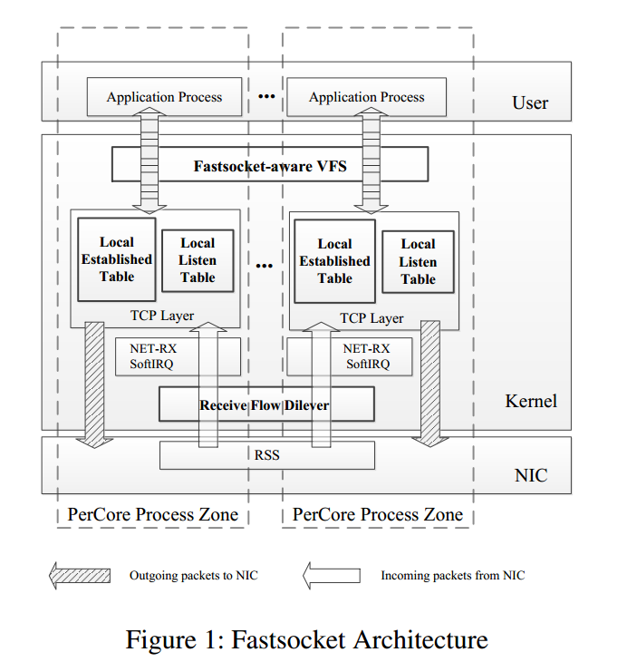
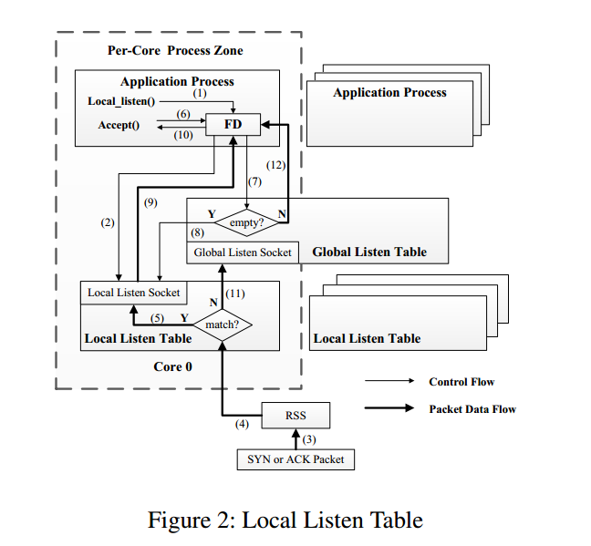
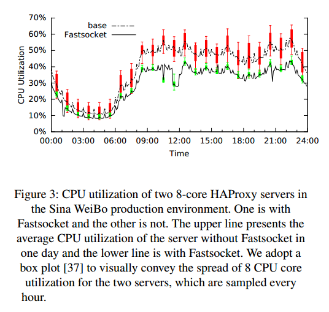

# 可扩展的内核TCP设计以及短连接的实现

目标是重新设计内核级TCP栈,在达到高可扩展性和低开销的同时,保持与BSD socket API的兼容性,这也是对大规模生产环境的真正需求。

## Summary of major innovations(重大创新)

Fastsocket通过向后兼容,递增可部署(incrementally deployable)和可维护的方式解决可扩展性和兼容性问题,通过三个主要变化实现：

* 为全局共享数据结构(listen table和established table)分区.
* 对任意连接,正确引导incoming数据包到连接位置(correctly steer incoming packets to achieve connection locality)
* 为VFS中的socket提供快速路径来解决VFS中的可扩展性问题,并完全保留BSD socket API.

### 三个关键贡献:

* 介绍了一种内核网络栈的设计,能够实现对TCB管理的表级分区(table-level connection partition),并且确保任意连接类型的连接位置(locality),分区方案是完整的,能够自然的解决所有沿着网络处理路径的潜在的竞争。包括不直接解决的争用:如定时锁争用。
* 证明BSD Socket API不一定是商业硬件配置的网络栈可扩展性的障碍,使用Fastsocket的吞吐量可以使用BSD Socket API在具有10G NIC的24核机器上扩展到20.4倍,结果表明,不存在可扩展性的原因而去放弃BSD Socket API。这种兼容性确保现有的网络应用程序不需要修改即可使用Fastsocket。
* 展示了通过对内核有节制的(moderate)修改,可以构建高度可扩展的内核网络栈。通过集成到内核框架中,Fastsocket的设计可以保证鲁棒性并且保存内核网络栈的所有特点,这使其成为生产环境部署的使用方案。

### Architecture

Fastsocket提供三个组件：

*  partitioned TCB data structures
  * Local Listen table
  * Local Established Table
*  Receive Flpw Deliver(RFD)接收流量传递
*  Fastsocket-aware VFS

通过这三个模块的合作为每个核提供流程区(process zones),在区域里,对于给定连接的所有活动,从NIC中断到应用程序访问,都在同一个CPU核上具有最小的跨核同步性处理。

为了构建Per-Core process Zone,对共享数据结构,连接核绑定(connection-core binding),和VFS抽象实现做了改进：

* Fastsocket完全分割了两个全局TCB表的数据结构和管理,而且,当NET_RXSoftIRQ到达TCP层时,Fastsocket使用 per-core local listen table和per-core local established table来完全分配TCB的管理。
* 在传入数据包进入网络栈之前,Fastsocket使用Receive Flow Deliver来引导数据包去正确的CPU核,在该核上对应的本地表被管理,而且相关的应用程序正在运行,这样,Fastsocket实现了最大的连接局部性,并最小的减少了CPU缓存的跳跃(bouncing)。
* 内核VFS层是socket API抽象和兼容的关键, Fastsocket-aware VFS绕过不需要的和锁密集的VFS  routines(例程),并且使用特殊的socket快速路径来消除可扩展性瓶颈，同时保留足够状态提供所有的socket API功能。

#### Local Listen Table

通过local listen table实现监听socket的表级分区,并且保证TCP堆栈的稳健性,而且还实现了被动连接的locality。

在内核TCP建立(setup)阶段,Fastsocket为每个CPU核分配一个local listen table,并且为了鲁棒性维护一个原始的全局监听表。

在启动时(startup),服务器应用程序的第一个进程会在特定的TCP端口上listen()等待客户端请求,内核相应的在全局监听表中建立一个监听socket,然后服务器fork多个进程,并且将它们与不同的CPU核绑定,这些子进程继承这个监听socket,并且准备好接收新的连接,并且进程并行接受连接。

每个进程调用local_listen()去通知内核想要处理来自它绑定到的CPU核上的传入连接(1),对于在CPU核0上绑定的进程,一个新的socket复制原始listen socket并且将其插入到CPU核0的local listen table(2).将复制的listen socket称为local listen socket,原始的是global listen socket。(3)-(6)和(8)-(10)描述了使用local listen table建立被动连接的fast (normal)path。(7)(11)(12)描述了slow(abnormal)path处理故障状态。

#### fast path

当SYN包进入(3),并通过RSS传送到CPU核0,内核会搜索CPU核0的local listen table以匹配local listen socket(4).没有发生故障的话,之前通过local_listen()插入的local listen socket将会匹配(5),三次握手完成后,就绪连接将被放置在local listen socket的接收队列中。当绑定在核0上的进程对新连接发出accept()时(6),内核首先检查global listen socket的接收队列(7),在正常情况下,接收队列始终为空,这个检查是在没有锁的情况下完成的,接着内核会检查核0的local listen table是否有任何就绪连接(8),自然的,可以找到先前准备好的连接(9),并且返回到应用程序(10).

因此,使用local listen table的表级分区,每个操作(除了无锁检查)都在local table上,这消除了被动连接建立期间的同步瓶颈。

作为副产品,还实现了被动连接的locality,因为所有的被动连接的处理(应用进程和内核中断上下文)都在同一个CPU核上。

#### slow path

在某些异常情况下,某些CPU核中的local listen table中复制的listen socket可能会丢失。

当SYN包在local listen table里不能找到匹配的local listen socket得时候,内核将会与global listen table中的global listen socket建立新的连接(11).当任何应用程序调用accept()的时候,首先global listen socket的接收队列会被检查(7),将会发现global listen socket中的就绪连接。然后内核可以accept()从global listen socket到应用进程的连接,就像传统的TCP栈做的那样(12)。

如前所述,需要先检查global listen socket中的accept queue(接收队列),然后再从local listen socket接受新的连接,这是因为在繁忙的服务器上,local listen socket中总有新的连接,假如先检查local listen socket,将在local listen socket中保持处理连接,并在global listen socket中使连接饿死(starve)。

而且,当检查global listen socket的时候不需要锁,因为它是通过单个原子操作读取检查队列指针是否为NULL来完成的,假如队列中有新连接(非常罕见),我们不得不锁定global listen socket。当socket被锁定时,再次检查接受队列,并且接受来自global listen socket的新连接,虽然涉及slow path,但这种情况在实践中很少发生,因此不会引起锁争用。

#### **Local Established Table**

使用local established table去划分established table以便本地(locally)访问established sockets.

Local Established Table设计如下:

* 当初始化网络栈时,Fastsocket为每个CPU核分配一个Local established table
* 新建的established socket被插入到local established  tables。
* 在NET_RX SoftIRQ中,内核检查local established table以匹配任何传入数据包的established socket.

Fastsocket保证对于任何连接,插入和匹配established socket在同一个CPU核上进行。

通过建立Local Established table，established sockets的管理被完全划分到CPU核间,无论单个机器CPU核数量有多少，这种设计消除了established table的可扩展性问题。

#### **Complete Connection Locality**

#### **Build Active Connection Locality**

当进行主动连接请求的时候,关键点是内核可以把当前的CPU核id编码为源端口(source port)。为实现这点,使用hash(p)来映射端口到CPU核。当在CPU核c上运行的应用程序试图建立主动连接时,RFD选择c=hash($p_{src}$)的端口$p_{src}$ ,当接收到响应包时,如果不是这个CPU核当前正在处理的包,RFD选择接受包$p_{dst}$的目标端口,即RFD之前选择的那个端口,通过hash($p_{dst}$)确定哪个CPU核应该处理这个包,并将数据包引导到选择的CPU核,以这种方式,RFD保证每个主动连接始终是由同一个CPU核处理,消除了non-local connection的问题。

#### Retain Passive Connection Locality

被动连接和主动连接可以同时存在于一台机器中,入站流量由被动传入数据包和主动传入数据包构成。在从目标端口传来的incoming包解码出CPU核ID之前,RFD必须区分两个传入包的类别,因为散列函数是为主动连接设计的，应当只被主动连接包使用。否则,RFD将会从local listen table中打断被动连接locality.

为了确定传入包是被动传入还是主动传入包,RFD使用以下规则:

* 如果传入数据包的源端口在well-known(小于1024)端口范围内,它应该是主动传入包,我们假设内核正常情况下不会在well-known端口里选择端口作为源端口。
* 如果目标端口是well-known端口,相同原因,认为它是被动传入数据包。
* (可选)以上条件都不满足,看数据包是否会匹配listen socket,如果是,它表明它是被动传入包,因为它不允许与之前侦听的源端口启动活动连接,否则,包是主动传入报。

#### **Leverage Hardware Features(利用硬件特性)**

RFD无需任何硬件特性即可正常工作,然而,当RFD需要引导包到不同CPU核上的时候,利用诸如FDir等高级NIC功能。

FDir有两种模式：Perfect-Filtering和ATR。当使用Perfect-Filtering的时候,RFD可以将hash函数编程到NIC中,以便将引导工作完全交给硬件。当使用ATR模式,因为NIC采样的原因,大多数传入的包都会被送入正确的CPU核。其余的则交给RFD处理。因此,RFD既可以因最小的额外NIC配置获取最大的性能优势而采用Perfect-Filtering,也可以使用ATR达到用最小的维护工作实现connection locality,并且可以与其它需要ATR模式的应用互存.

#### RFD Implementation

Hash Function:

​	hash(p)=p & (ROUND_UP_POWER_OF_2(n) -1 )

ROUND_UP_POWER_OF_2(x)：返回$2^t$ 使得正好大于x(例如100对应128 )

n:CPU核数

这个函数可以很容易在Perfect-Filtering模式(只支持按位操作)下编程到FDir中。

可以通过随机选择使用的位来引进随机性提高安全性,有助于防止尝试使服务器在同一个CPU核上处理所有连接的恶意攻击。

**Fastsocket-aware VFS**

Sockets和磁盘上的文件从本质上是不同的:

* Sockets不在磁盘上。因为磁盘处理速度慢,dentry和inode被用来作为文件元数据的内存缓存。然而,Sockets的生命周期一直在内存中,不能从设计inode和dentry的缓存机制中受益。
* 目录路径并没有被用于识别Socket.通常,目录路径用于标识磁盘文件,内核将目录路径映射到dentry和与其对应的inode以便查找文件。然而,sockets直接通过文件结构的private_data域访问。因此,dentry和inode没有被用来标识sockets.

因此,dentry和inode的功能对sockets无用,但是为了与VFS抽象兼容仍然与sockets关联。当sockets经常被分配时,引入了巨大的同步开销。

所以引入Fastsocket-aware VFS既解决socket的扩展瓶颈,同时保持与旧版VFS兼容。

* 避免不必要的开销。Fastsocket-aware VFS为避免不必要的开销,在socket的VFS处理方面提供了快速路径(fast path),Fastsocket-aware VFS在创建/销毁 socket的时候跳过了dentry/inode的大部分初始化/销毁工作,包括获取各种锁和管理各种表和链接中的dentry和inode.
* 保持兼容性。因为会破坏与旧版socket的兼容性,所以无法完全从socket中删除dentry和inode。例如广泛使用的系统工具(lsof和netstat)将会失效,因为他们通过/proc文件系统访问对应的socket状态,这依赖于dentry和inode(但是不要求他们完全初始化)。Fastsocket-aware VFS只保留dentry和inode的必要状态和功能来支持/proc文件系统,只需花费很小的代价便可以实现兼容性。

## What the problems the paper mentioned?(提到的问题)。

生产环境需要自底向上的并行的TCP协议栈的设计以便能够逆向兼容已有的应用。

在生产环境中,如数据中心,网络服务器/代理应用有三个基本要求:

* TCP/IP相关RFC的**兼容性**,不同的程序遵循不同的TCP/IP相关RFC,因此,生产环境中的TCP/IP实现也需要尽可能的支持普遍被接受应用的RFC。
* **安全性**：TCP可能会受到多种方式的攻击,需要操作系统内核对TCP做彻底安全的保护。
* **资源隔离和共享**:TCP/IP需要支持多种存在的NIC硬件资源,并且应该与其它名称空间或子系统(磁盘,文件系统等)隔离或共享数据。

### TCB管理的瓶颈

全局TCB管理是多核平台TCP栈的主要可扩展性瓶颈,因为运行这些全局TCB时得互斥要求,使用了大量的锁,导致多个CPU核同时更新TCB(Linux中表示为socket)时潜在的锁争用。

#### Global Listen Table

在与请求同一个服务端口的并发客户端建立被动连接时,全局listen socket被用来在所有CPU核上建立连接,这是一个主要的可扩展性瓶颈。

SO_REUSEPORT与Megapipe通过socket-level分区来解决这个可扩展性瓶颈,通过保存副本的方式,这些副本连接在listen table的一个桶的列表上,应用程序进程只接受来自自己监听socket副本的新连接,但是会引进新的问题,因为每次都要遍历桶列表以选择监听socket,复杂度为O(n)。(n是服务器中的CPU核数),因此当核增加时,匹配监听socket的成本将足以成为瓶颈。

使用naive table-level partition,每个CPU核有自己的本地监听表,其中包含了复制的监听套接字,以避免O(n)复杂度搜索桶列表,然而,这种方式会终端TCP栈,例如应用程序中的一个进程崩溃,操作系统会销毁该进程创建的监听套接字副本。在这种情况下,该特定CPU核的本地listen table中将不再有该监听socket副本。当SYN数据包传递到CPU核中,它不能匹配本地socket表中的任意监听socket,来自客户端的连接请求将被RST数据包拒绝,即使其它应用程序进程(在其它CPU核上)能够处理客户端连接,这破坏了TCP的鲁棒性。

#### Global Established Table

当一个主动或被动连接建立时,一个新的socket被创建或添加到established表。Linux采用桶锁来同步修改多个CPU核共享的established表。当CPU核和并发连接数都快速增长的时候,全局established表不可避免将引发相当大的锁争用。锁粒度细化只是一个优化,但不是解决可扩展性问题的彻底解决方案。简单地将全局established表划分为每个核的本地表不能正常工作,因为无法保证在NET_RX SoftIRQ中,任意incoming包总是在由同一个CPU核(在本地established表中具有相应socket)处理。

#### Lack of Connection Locality

单个连接中的传入和传出数据包可以由两个不同的CPU核处理,会导致CPU缓存跳跃(bouncing)与性能下降,因此,为了最大实现扩展性,期望实现完全的连接位置(complete connection locality),即:对于给定连接的所有活动都由同一个CPU核处理,包括主动和被动连接。完整的连接位置不仅仅是一个性能优化,而是分配established表的先决条件,如果能够保证连接始终在同一个CPU核上处理,自然会解决established表划分问题。

完整性是一个真正的挑战,至今没有办法通过各种优化来解决这个挑战,只能提供一个概率保证。

对于被动连接,Affinity-Accept和Megapipe通过使运行应用程序的CPU核接受新连接来保证连接位置,不幸的是,这种设计不适用于代理和RPC中大量使用的主动连接。因为主动连接在应用程序中初始化,无法控制CPU核的选择。连接将在以后的NET_RX_SoftIRQ中进行处理。

为了提高connection locality,RFS(Receive Flow Deliver)被引入Linux,RFS引入了一个表来跟踪系统中的连接,表中,RFS记录应用中的每个连接都在CPU的哪个核中做处理,并根据该表传送incoming包,然而,因为表大小的限制,管理表引入了相当大的开销,并且表大小有限制,无法保证完整的连接位置。

#### **Additional Overhead for Compatibility(实现兼容性的额外开销)**

Socket在VFS中被抽象为一种特殊的文件类型。VFS为每个socket分配对应的inode和dentry数据结构,当频繁分配socket的时候,VFS花费大量的精力来管理全局可见的inode和dentry,这涉及昂贵的同步。作者认为socket不必继承这种开销,即使他们越来越小,因为inode和dentry没必要被socket使用,因为网络和磁盘文件有本质的区别。

最新的研究提出了两种新的设计来解决Socket和TCP栈的VFS可扩展性问题, 用户级TCP栈和一个新的IO API设计,这两种方法以牺牲高级TCP栈的特性和向后兼容性避免了同步。

* 用户级TCP栈,mTCP,或者是修改的嵌入式TCP协议栈,IwIP,通过绕过所有内核的复杂性,实现高性能。首先,实现的是轻型版本的TCP栈,许多在实践中很有用的高级特性例如命令空间和防火墙都没有实现。虽然这些栈可以复制内核函数,但是将会是很复杂并且昂贵的开发过程,第二,这些网络栈提供的API与BAD socket和VFS以及RFC不完全兼容,导致应用中将会做昂贵的代码变更。最后,为了让NIC和这些TCP栈一起工作,不能在与内核共享NIC,从而阻止一切正常应用在同一个NIC端口运行,这些限制在生产环境中不切实际。
* Megapipe引入了一种新的完全绕过VFS的新的I/O API,并维护用户级TCP栈不提供的内核优势。然而,Megapipe不再与socket API兼容,如果要部署Megapipe,必须要修改所有存在的应用和工具,因为Megapipe提供了不同的网络编程模型,一些修改是不必要的。不兼容性严重限制了Megapipe的实用性。

## How about the important related works/papers?

* 论文14,21介绍了Reducing shared resource contention(减少共享资源争用)。VFS的inode和dentry已被确定为socket可伸缩性的瓶颈,并提出了一种更细粒度的锁方案来减轻核之间的共享资源争用。Megapipe提出一种新的信道设计绕过VFS,然而失去了和VFS的兼容性。这迫使传统应用程序修改代码,同时还导致一些系统工具的行为出问题,如netstat何lsof.
* 实现connection locality。Affinity-Accept和Megapipe在被动连接情况下实现connection locality。通过实现local listen table和Receive Flow Deliver使得主动和被动连接实现完全connection locality.
* 批处理系统调用和零拷贝通信。FlexSC和Megapipe提出了系统调用批处理以节省上下文切换的成本。
* ​

## What are some intriguing aspects of the paper?

* Fastsocket通过local listen table解决了被动连接建立的可扩展的瓶颈,并且在应用程序故障时,保障了TCP稳健性,还达到了被动连接的局部性(connection locality)。
* Fastsocket实现了在listen table和established table的表级分区,和TCB管理的完整分区。
* 通过Local Listen Table和Receive Flow Deliver,Fastsocket实现了完全的connection locality.
* Fastsocket-aware VFS内部为socket自定义VFS,在保持与socket应用和系统工具的兼容性的同时,提高了可扩展性。
* relax系统调用对语义的限制。论文16,21指出了POSIX规范中最低可用的文件描述符,因为可扩展性差,放宽了规则。
* 具有硬件虚拟化的图书馆操作系统(library operating systems with hardware virtualization)
* 网络预留系统(reserving cores for network Isostack)旨在通过一种新颖的架构来提高网络系统效率。

## How to test/compare/analyze the results?

从两方面评价Fastsocket的性能和可扩展性:

* Fastsocket是否有益于真正的应用程序?

  在一个生产环境上,在8核服务器上运行HA PRoxy作为HTTP负载平衡器来评估Fastsocket。通过部署Fastsocket，观察到有效处理能力(effective capacity)提升了53.5%。而且,还对Nginx和HAProxy做了实验评估,这是项目基础设施中最重要的两个组成部分,结果显示在24核机器上,使用Fastsocket吞吐量分别超过基本Linux的267%和621%

* 与现有的TCP内核栈实现相比,Fastsocket的可扩展性如何(scale 规模),特别适合于短期TCP连接处理?

  在24核机器上,Fastsocket吞吐量可达20倍,而Linux 3.13使用SO_REUSEPORT实现仅是12倍。而且,收集了锁信息和L3共享缓存缺失率的统计信息以便描述每个设计为什么和怎么样有益于整体性能。

通过展示Fastsocket出色的可扩展能力,说明BSD socket API不再是TCP栈的可扩展性障碍。

### 测试环境

三台机器,每台机器有：

* 两台12核Intel Xeon E5 2687 v2处理器
* 64GB内存
* 双端口(dual-port) Intel 82599 10GE NIC。

如果没有明确配置FDir,NIC将采用RSS,根据所涉及的CPU核数配置NIC队列数。通过配置NIC终端相关性和XPS(发送数据包转向)使得每个RX和TX队列分配给一个CPU内核,因为基准内核在使用单个监听socket的时候充分利用CPU资源有困难,因此所有的基准测试(benchmarks)监听同一个端口80的不同IP地址。

所有的基准测试都可以为每个应用服务器分配多个进程并将每个进程引导到不同的CPU内核。因为主要关心的是连接建立和终止相关的成本,使用connections per second(每秒连接)来评估吞吐量。

使用http_load作为http工作负载生成器。

没有Fastsocket,平均CPU利用率相对较高。而且,CPU利用率的变化非常高。(error bar显示不同核之间的最大和最小利用率)。潜在的原因是Linux内核使用共享资源和锁争用。当核依次获取锁时,第一个CPU核连接,最后一个核可能没有连接,当内核通知应用程序有新的连接准备被accept的时候,可能会发生这种情况。这使得某些CPU核有更多的连接处理,并引入不同的CPU核之间的维持负载差异。

相比之下,使用Fastsocket,由于锁争用的开销较低,平均CPU利用率大大降低。而且所有的CPU核利用完美平衡,因为Fastsocket消除了共享资源和TCP栈的锁争用。

